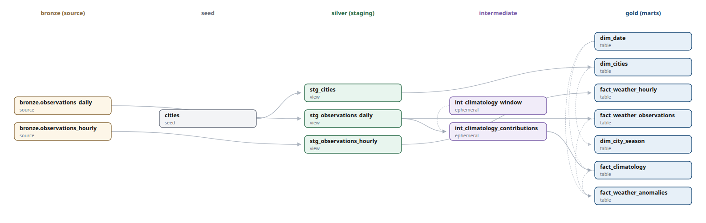
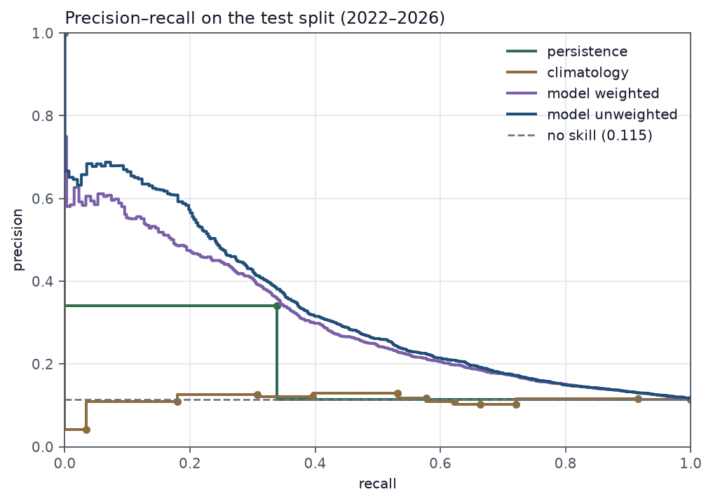
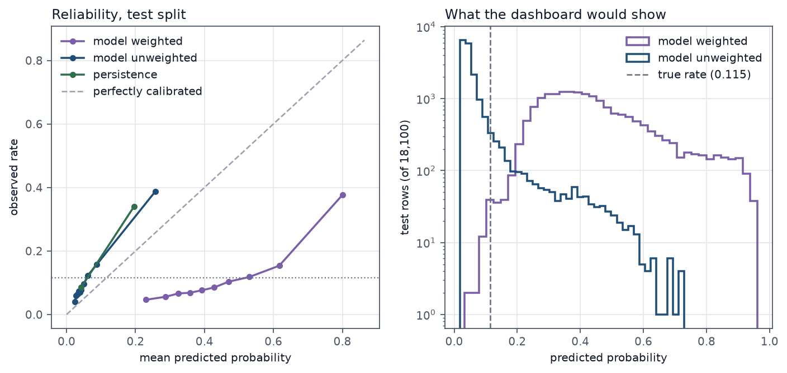
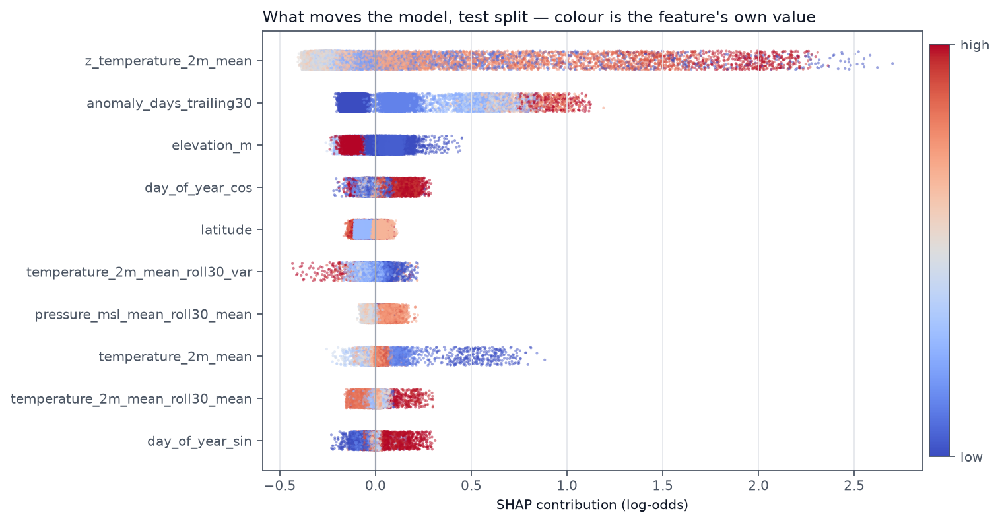
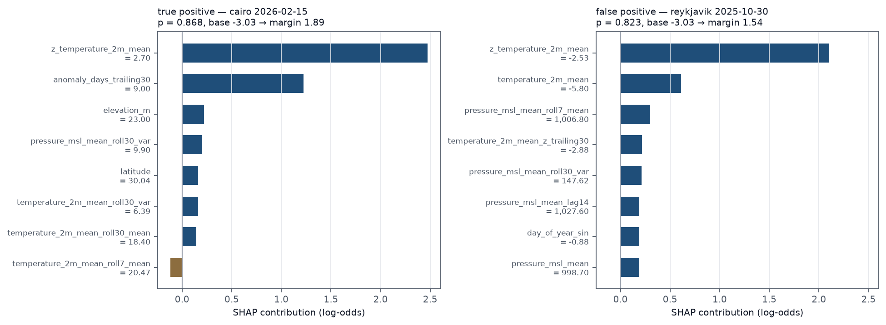

# Climate Volatility & Risk Engine

An end-to-end analytics platform that ingests three decades of global weather observations, models them into a governed dimensional warehouse, and forecasts extreme temperature anomalies across fifteen major cities.

> **Status:** in development. This README is a stub; the full write-up — architecture diagram, model metrics, live dashboard link, and five-minute setup — lands on Day 15. The complete proposal and delivery plan is in [`docs/proposal.md`](docs/proposal.md).

## Live dashboard

<!-- BI-07: replace the placeholder below with the deployed URL, and set the
     same URL in the repository's About field. tests/check_deployment.py
     verifies it and records the cold start. -->

**Not yet deployed.** The app is built, verified against Neon, and cleared for
publication — the deploy itself is a console action that has not been taken.

```bash
streamlit run dashboard/app.py                         # locally, against Neon
python tests/check_deployment.py <url> --cold          # once it is published
python tests/check_deployment.py <url> --screenshots docs/images
```

## Configuration

No credentials are committed to this repository, and none ever have been. All configuration is supplied through environment variables:

```bash
cp .env.example .env   # then fill in the values
python config.py       # prints the resolved config, secrets masked
```

Every variable is named and documented in [`.env.example`](.env.example), and [`config.py`](config.py) is the only module that reads the environment. `.env` is git-ignored.

## Warehouse topology

Two Postgres environments, switched by a single environment variable. No code
branches on which one is in use.

| | Host | Holds | Used for |
|---|---|---|---|
| **Local** | PostgreSQL 16 in Docker Compose | bronze → silver → gold | The 30-year backfill, all dbt iteration, model training |
| **Serving** | Neon free plan, project `horizon` (`aged-paper-67892047`, `aws-us-east-2`) | gold marts and predictions only | What the public Streamlit dashboard reads |

**The backfill runs locally and Neon receives finished gold marts only.** Two
free-plan limits force this and shape everything downstream:

- **0.5 GB storage.** Raw API responses are kept as gzipped files under a
  git-ignored `data/raw/`, never as a per-row JSON column — that alone would
  exhaust the budget. Bronze and silver never leave the local container.
- **100 compute-hours per month.** A multi-hour backfill against a serverless
  database is slow and wastes the allowance. Neon sees one bulk load per
  promotion, then read-only dashboard traffic.

Neon scales compute to zero after five minutes idle and resumes on the next
query, so there is no keep-alive job to maintain. Measured from a development
machine in South Africa against `aws-us-east-2`:

| | Connect + first query |
|---|---|
| Warm (compute active, median of 5) | 2409 ms |
| Cold (after 340 s idle) | 3619 ms |
| **Cold-start penalty** | **~1.2 s** |

Only the 1.2 s is Neon resuming compute. The 2.4 s floor underneath it is
distance: TCP handshake to that region measures 271 ms round-trip and TCP+TLS
553 ms, so a Postgres connection's handshake and SCRAM exchange spend roughly
eight round-trips crossing an ocean. **This is a local-development cost, not a
production one** — the dashboard is deployed to Streamlit Community Cloud,
which sits on the same continent as the database. Do not tune the schema in
response to latency observed from a laptop.

Reproduce with:

```bash
python tests/check_connection.py --target serving --cold   # after 5 min idle
python tests/check_connection.py                           # both targets
```

### Quota dashboards

Free-plan usage is not exposed through the API, so these are console links:

- Project overview and storage — <https://console.neon.tech/app/projects/aged-paper-67892047>
- Compute metrics — <https://console.neon.tech/app/projects/aged-paper-67892047/monitoring>
- Org usage against the free-plan allowance — <https://console.neon.tech/app/orgs/org-twilight-mode-94780402/billing>

### Known deviation

Neon provisioned the project on **PostgreSQL 18**; local development runs
**PostgreSQL 16**, as specified. The gold marts use no version-specific syntax
and both targets are verified by the same connection check, but the skew is
recorded here rather than discovered later.

## Source API

Open-Meteo's historical archive (ERA5 reanalysis), `archive-api.open-meteo.com/v1/archive`.
No API key, no credential variable. [`ingestion/client.py`](ingestion/client.py)
is the only module that talks to it.

```bash
python ingestion/client.py --city london --year 2023            # daily
python ingestion/client.py --city singapore --year 2024 --grain hourly
```

### Nothing is left to a default

The API's defaults are local time and metric units. A request that omits
`timezone=UTC` still returns 200 and still looks like weather — it just has the
day boundaries shifted, which would poison a 30-year climatological baseline
without failing any obvious downstream test. So the client states every
unit-bearing parameter (`timezone`, `temperature_unit`, `wind_speed_unit`,
`precipitation_unit`, `timeformat`, `cell_selection`) and then **verifies the
response against what it asked for**: a non-zero `utc_offset_seconds`, a changed
unit string, a missing variable, or a row count that does not match the
requested range all raise rather than land.

All 21 daily and 12 hourly variables were diffed against the documentation
against a live response on 2026-09-07. The unit each is expected to report is
asserted on every response, so the day an upstream default changes the run stops
instead of writing kilometres per hour into a column commented `km/h`. Two
details that a units assertion catches and a schema does not: `snowfall_sum` is
**centimetres** while every other depth is millimetres, and
`shortwave_radiation_sum` is **MJ/m²**, not W/m².

### Requests are snapped to a grid cell, and the client records which

ERA5 is gridded reanalysis, not station data. The coordinates in
`config/cities.yml` are not the coordinates that answer:

| | Requested | Answered |
|---|---|---|
| London | 51.5074, −0.1278 at 11 m | 51.4938, −0.1630 at 16 m |
| Singapore | 1.3521, 103.8198 at 15 m | 1.3708, 103.8024 at 46 m |

Every row therefore carries `api_latitude`, `api_longitude`, and
`api_elevation_m`, so provenance survives an edit to `cities.yml`. The request
URL is *not* stored per row — see [Measured storage](#measured-storage) — it is
derived from the archived window by `archive.source_url_for()`. `cell_selection=land` is sent explicitly — it is the
default, but it is the parameter deciding whether Lagos is Lagos or the Bight of
Benin. `elevation` is deliberately *not* sent; passing it would override
Open-Meteo's 90 m DEM downscaling and change the values returned.

### Failure policy

The backfill is hundreds of requests running for hours, so a transient 502 is
not a possibility but a certainty. Measured against London from a development
machine:

| | Rows | Response | Wall | API generation |
|---|---|---|---|---|
| One city-year, daily | 365 | 47 KB | 970 ms | 35 ms |
| One city-year, hourly | 8 784 | 732 KB | 809 ms | 230 ms |

- **Timeouts are an explicit (connect, read) pair.** `requests` applies none by
  default; a socket that opens and then goes quiet would hang the run forever
  with no traceback. `REQUEST_CONNECT_TIMEOUT_SECONDS` and
  `REQUEST_TIMEOUT_SECONDS`.
- **5xx, timeouts, and truncated bodies** retry with exponential backoff plus
  jitter, capped at `MAX_RETRY_ATTEMPTS` total attempts. The jitter is not
  decoration: without it, fifteen cities that failed against one upstream blip
  retry in lockstep and reproduce it.
- **429 honours `Retry-After`** — both the delay-seconds and HTTP-date forms —
  rather than backing off blindly, which would otherwise retry sooner than the
  server allows or wait far longer than needed. It is capped at five minutes so
  a misconfigured proxy cannot park the backfill for a day. Open-Meteo sends
  *no* header and a body reading "Minutely API request limit exceeded. Please
  try again in one minute", so the headerless case waits a full minute rather
  than falling back to exponential backoff — 2s, 6s, 10s, 16s never spans the
  window the server is asking for, and burns every attempt for nothing.
- **4xx raises on the first attempt** with the response body in the message.
  Open-Meteo's `reason` field names the offending parameter, and a bad request
  will fail identically on every retry.
- **Retries are re-raised as the real exception**, not a `RetryError` wrapper,
  so a caller can tell a rate limit from a dead connection.

## Backfill planner

[`ingestion/planner.py`](ingestion/planner.py) decomposes the backfill into
city × window work units, records what has landed, and paces the run.

```bash
python ingestion/planner.py                    # the plan and what it costs
python ingestion/planner.py --list             # every pending unit
python ingestion/planner.py --progress         # what the manifest says landed
```

### Open-Meteo meters weighted calls, not HTTP requests

This is the finding that shapes the whole workstream. A request costs
`(variables / 10) × (days / 14)` API calls, each factor floored at 1 — so one
city-year of the 21 daily variables costs **55 calls, not one**.

Measured on 2026-09-07: five requests for London — one, two, five, ten and
thirty years of daily data — were refused on the fifth with `HTTP 429 Minutely
API request limit exceeded`. Five requests is nowhere near the documented
600/min. Their *weighted* cost is 55 + 110 + 274 + 548 = 987 by the fourth,
crossing 600 exactly where the refusal landed. The formula is what the planner
budgets against, and `test_the_observed_429_is_consistent_with_the_formula`
pins that reasoning down.

Two consequences:

- **Chunk size is quota-neutral above a fortnight.** Weight is proportional to
  days, so ten one-year units cost what one ten-year unit costs. Below 14 days
  the floor makes short units cost a full call each — smaller is never cheaper,
  it only buys finer resume granularity. That frees the default to be chosen
  for legibility: **one calendar year**, measuring 47 KiB daily / 732 KiB
  hourly, at 55 / 31 weighted calls.
- **A fixed inter-request delay is not enough.** One second between city-years
  would spend 3 300 calls a minute against a 600 budget. `REQUEST_DELAY_SECONDS`
  is a *floor*; the planner derives the real delay from each unit's weight.
- **And the minutely allowance is not the binding one.** Half of 600 calls a
  minute is 18 000 an hour, against an hourly allowance of 5 000. The first
  real backfill run cleared the minutely bar on every request and still
  collected `HTTP 429 Hourly API request limit exceeded` nineteen minutes in,
  having spent 5 059 calls. Pacing now takes the larger of the two derived
  delays, which is four times slower — **~44 s between one-year daily units**,
  not 11.

### The backfill does not fit in one day of free quota

| | Units | Rows | Weighted calls |
|---|---|---|---|
| Daily, 1995 → present | 480 | 173 505 | 26 026 |
| Hourly, trailing 24 months | 45 | 263 160 | 957 |
| **Total** | **525** | **436 665** | **26 983** |

Against an allowance of 10 000 calls/day that is **2.7 days**, not the "runs for
hours" the delivery plan assumed. This is not something to engineer around — it
is the reason the manifest exists. `Plan.within_daily_quota()` returns the
prefix that fits in today's allowance; the run stops there and tomorrow's
session resumes from the manifest.

### Resumability

Completed units are appended to a JSONL manifest (`INGEST_MANIFEST_PATH`,
git-ignored) and fsynced before the next unit starts, so a record on disk means
the rows really are in the warehouse. Append-only rather than a rewritten
document because the failure being designed against is the run dying mid-write:
a truncated final line costs one re-fetched unit, a truncated rewrite costs the
whole history.

Completion is tested by **date coverage**, not by matching the window key, so
the chunk size can change between sessions. The natural response to a 429 or a
timeout is to halve it, and re-fetching everything landed so far would be a
harsh price for that:

```
5 one-year units planned, 2 landed
  → re-plan at 12 months:  3 pending, 2 skipped
  → re-plan at  6 months:  6 pending, 4 skipped   # still skipped
```

The limit is honest and tested: *growing* the chunk past a landed boundary
re-fetches the partly-covered window.

## Raw payload archive

Every response is gzipped to
`data/raw/{grain}/{city_id}/{start}_{end}.json.gz` exactly as it arrived — not
re-serialised, not reordered, not validated. `data/` is git-ignored and nothing
under it is tracked.

```bash
python ingestion/archive.py             # what is on disk
python ingestion/archive.py --verify    # re-parse everything, no network
python ingestion/archive.py --stats     # measured size, projected to the full backfill
```

### The write happens before the parse

That ordering is the whole point. A parsing bug found on day seven — a unit
misread, a timestamp off by an hour, a column mapped to the wrong variable —
costs a re-run of the transformation if the payloads are on disk, and a
[2.7-day re-pull](#the-backfill-does-not-fit-in-one-day-of-free-quota) if they
are not. So archival hangs off an `on_payload` hook that
`fetch_observations` calls between the successful response and
`parse_payload`, and a response that fails validation is still on disk
afterwards. The hook runs outside the retry loop, so failed attempts are never
archived, and an exception from it propagates — a response fetched and then
dropped on the floor is worse than a loud failure.

Replay feeds archived payloads through the *same* `parse_payload` the live
path uses, so fixing a parser bug fixes replay by construction rather than
twice. The request URL is reproduced by `request_url()`, which prepares the
identical string through `requests` rather than assembling it by hand — tested
against a live response. That same function is what lets bronze omit the column
entirely.

### Measured size

Sampled across five climates and both grains (London, Reykjavík, Singapore,
Phoenix, Sydney daily; London and Cairo hourly):

| | Rows sampled | Compressed | Ratio |
|---|---|---|---|
| Daily (21 variables) | 1 826 | 33.5 B/row | 29% of raw |
| Hourly (12 variables) | 17 568 | 14.9 B/row | 20% of raw |

Projected across the full 436 665-row backfill: **5.5 MiB daily + 3.7 MiB
hourly ≈ 9.3 MiB**. Two decimal orders below the 0.5 GB Neon allowance the
per-row `jsonb` column would have eaten into — and it never goes near the
database at all.

Files are written to a temporary name in the destination directory, fsynced,
then renamed over the target, so a crash mid-write leaves the previous file
rather than a truncated one. `mtime=0` and an empty gzip `filename` field keep
the output byte-identical for identical input, which makes re-archiving a unit
detectably a no-op.

## Bronze loader

[`ingestion/loader.py`](ingestion/loader.py) replays archived payloads into
`bronze_raw.observations_daily` and `_hourly`. It reads from disk, never from
the network.

```bash
python ingestion/loader.py --dry-run     # what would be loaded
python ingestion/loader.py               # load everything not yet in the manifest
```

### What it does not do

Bronze's job is faithful landing. Nothing here converts a unit, shifts a
timezone, fills a gap, or deduplicates a row — each of those is a decision, and
a decision belongs in dbt where it is SQL, version controlled and tested, not
buried in a Python loader where it is invisible to anyone reading the models.
Every one of those negatives has a test that fails if a future well-meaning
change adds the cleverness.

The judgement call is null handling, and it is exercised in the direction of
doing nothing: a null in the payload is a null in the warehouse. Coercing it to
zero would turn "this grid cell reports no snowfall data" into "it did not
snow" — a different claim, a wrong one, and indistinguishable from a real
measurement afterwards.

Two things make that work, and both were caught by tests rather than reasoned
about:

- The frame is built with `dtype=object`. Left to itself pandas widens any
  column containing a null to `float64` and replaces the null with `NaN`, so
  `weather_code` would arrive as `51.0` and a missing value would land as a
  float rather than SQL NULL.
- The CSV handed to `COPY` uses `QUOTE_NOTNULL`, not the default
  `QUOTE_MINIMAL`. Postgres reads an *unquoted* empty CSV field as NULL and a
  quoted one as an empty string; `QUOTE_MINIMAL` writes both as nothing at all,
  which would silently null any empty string.

Type conversion is refused rather than performed. A `smallint` column rejecting
`"98.0"` means the API changed how it represents an integer, and landing it
quietly as `98` would hide that — the payload is already archived, so nothing
is lost by stopping, only delayed.

### Throughput

`to_sql`'s `method=` hook runs `COPY FROM STDIN` instead of pandas' multi-row
`INSERT`. Measured locally: **19 394 rows in 0.7 s (~28 000 rows/s)**, which
puts the full 436 665-row backfill at roughly 15 seconds of load time. A test
asserts no `INSERT` statement is issued at all, so the mechanism is pinned
rather than described.

Each unit commits in its own transaction, and the manifest is recorded *after*
that commit — so a manifest entry always means the rows are really in the
warehouse. `batch_id` groups every row one run wrote, so a bad run is undone
with a single `delete ... where batch_id = ...`.

## Running the backfill

[`ingestion/backfill.py`](ingestion/backfill.py) is the only module that drives
the others.

```bash
python ingestion/backfill.py --grain daily --dry-run   # what it would do
python ingestion/backfill.py --grain daily             # run it
python ingestion/backfill.py --report                  # what landed
```

Per unit, in this order and no other:

1. If the payload is already on disk, **no request is made** — the archive is
   the fetch cache as well as the replay source, so a run killed between
   fetching and loading costs nothing to resume.
2. Otherwise fetch it, archiving before parsing.
3. Load it into bronze in its own transaction.
4. Record it in the manifest, *after* that transaction commits.

Step 4 last is the whole resumability story. A manifest entry means the rows
are in the warehouse; anything less would let a crash leave the next run
skipping a window whose rows are missing, with nothing downstream reporting the
hole.

Ctrl-C once finishes the unit in flight and stops cleanly — the signal sets a
flag checked between units rather than raising wherever the interpreter happens
to be, which could be mid-`COPY` or in the one window between the warehouse
commit and the manifest write. Twice restores the default handler.

### Three rate limits, and only one is worth waiting out

The 429 body names the allowance it spent, and the three want different
responses:

| Body says | Response | Why |
|---|---|---|
| `Minutely API request limit exceeded` | wait 60 s, retry | A minute passes inside a request's retry budget |
| `Hourly API request limit exceeded` | fail immediately | An hour does not. Four 60 s retries take four minutes to arrive where they started |
| `Daily API request limit exceeded` | fail immediately | Same, more so |

Measured on the same failure: **1 second to stop, against 4 minutes before**.
With a manifest, stopping and resuming is free, which is what makes failing
fast the cheaper answer.

### Measured throughput

| | |
|---|---|
| Sustainable pace | ~44 s/unit (hourly allowance, 90% of 5 000 calls/h) |
| Landing speed | ~28 000 rows/s (`COPY`) — never the bottleneck |
| Hourly ceiling | ~81 one-year daily units, ~4 500 weighted calls |
| Daily ceiling | ~180 units, ~9 900 calls |
| **Full daily backfill** | **480 units, 26 026 calls → ~2.7 days of free quota** |

The pacing dominates entirely: a one-year unit takes ~0.3 s to fetch and ~0.02 s
to load, then waits 44 s. Day 3's "several hours of wall-clock time" is
optimistic by a factor of roughly ten, and the fix is not engineering — it is
running the thing across three days, which the manifest makes free.

## Hourly grain, and what bronze actually costs

Hourly observations cover the **trailing 24 months only** — the Storm Dynamics
view is their only consumer. Thirty years at the same grain would be over four
million rows for no analytical benefit, and would threaten Neon's allowance if
bronze were ever promoted.

```bash
python ingestion/backfill.py --grain hourly --anchor 2026-09-02
python ingestion/backfill.py --report --grain hourly --anchor 2026-09-02
```

The window is **anchored, not relative to now**. `--anchor` names the date it
ends at and `INGEST_HOURLY_MONTHS` how far back it reaches. Left to the default
the anchor is the archive edge, which moves — so "the trailing 24 months"
describes a different window tomorrow, and a plan that cannot be reproduced
cannot be verified. 45 units, 263 160 rows, 957 weighted calls: under a tenth
of a day's free allowance, against the daily grain's 26 026.

### Measured storage

| | Rows | Bytes/row | Projected full table |
|---|---|---|---|
| `observations_daily` | 173 505 | 270 | **47 MB** |
| `observations_hourly` | 263 160 | 224 | **59 MB** |

Bronze projects to **~106 MB**, comfortably inside the proposal's ~250–300 MB
budget for all layers. It did not start there.

**`source_url` was 83% of the daily row payload and 81% of the hourly one** —
712 and 466 bytes of the same few hundred distinct strings, repeated once per
row, for a projected **300 MB of the original 373**. §5.2 asked for it per row;
measuring it showed the column was both the dominant cost and entirely
derivable, since `request_url()` already reconstructs the exact string from
`(city_id, grain, start, end)` — which is what ING-03's replay depends on.

It is gone from the schema. `archive.source_url_for(city_id, grain,
observation_time)` finds the archived window covering a row and rebuilds its
URL, at no bytes per row. **Deviation from §5.2, deliberate:** the trade is
268 MB of warehouse against `data/raw/` becoming load-bearing for provenance as
well as for replay — delete the archive and row-level URLs are no longer
recoverable. `schema.sql` carries an idempotent `drop column if exists` so an
existing database converges on re-apply; Postgres only returns the space on
`VACUUM FULL`, which the schema file deliberately does not run.

The other thing measurement turned up, also now in `--report`:
**`pg_total_relation_size` counts dead tuples.** The first hourly reading was
31 MB against a true 12 MB — the table had been loaded and cleared repeatedly
during development. The report names the dead share when it exceeds a tenth and
says to `VACUUM FULL`.

## Idempotency

`make run` invokes ingestion on every call, so a loader that is not idempotent
corrupts the warehouse a little further each time. The guarantee has two layers
and neither is sufficient alone.

**1. Run level — the manifest.** A unit recorded as landed is not planned
again, so a re-run makes no requests and writes no rows. This is exact, not
approximate: the row count after a re-run is the *same number*.

Measured against the three cities complete in bronze — 35 069 rows, ids
5272..135388:

```
re-run 1:  0 units planned, 0 requests, 0 rows, 0.00s
re-run 2:  0 units planned, 0 requests, 0 rows, 0.00s
re-run 3:  0 units planned, 0 requests, 0 rows, 0.00s
fingerprint (count, min id, max id, distinct observations): identical
```

A no-op re-run costs one manifest read and no network at all, which is what
makes putting ingestion in `make run` reasonable rather than merely tolerable.

**2. Row level — append-only bronze, deduplicated in silver (DBT-02).** There
is exactly one window layer 1 cannot cover: a crash between the warehouse
commit and the manifest write leaves rows that nothing has recorded, and the
next run lands them again.

That direction is deliberate. The manifest is written *last* — writing it first
would let the same crash leave a manifest claiming rows that are not there, and
a hole is silent where a duplicate is not. Duplicates are recoverable; holes
are discovered in month three by a climatology that is quietly wrong.

So bronze carries no unique constraint on `(city_id, observation_time)` — one
would reject a legitimate re-ingest — and silver takes the most recent
`ingested_at` per pair:

```sql
select * from (
  select *, row_number() over (
    partition by city_id, observation_time order by ingested_at desc
  ) as rn
  from bronze_raw.observations_daily
) ranked where rn = 1
```

`tests/test_idempotency.py` runs that query over deliberately duplicated
bronze, so "deferred to DBT-02" is a demonstrated claim and not a promise: it
collapses to exactly one row per pair, keeps the newest copy, and does not
reach across cities.

**Blast radius.** Re-running one city touches only that city — a test pins the
others' row count, id range, distinct timestamps and value sum, all unchanged.
Re-running one city-year duplicates exactly that year and nothing else.

**Re-landing is free.** A lost manifest costs no quota: the payloads are
already in `data/raw/`, so the second run serves every unit from the archive
and makes zero requests.

`--report` surfaces the symptom directly, since duplicates are legal and
therefore easy to stop noticing:

```
36,895 rows total
365 of them (1.0%) are a second copy of an observation already present.
```

## Reconciliation

Expected against actual, per city, with every gap catalogued and categorised.

```bash
python ingestion/reconcile.py --grain daily
python ingestion/reconcile.py --grain hourly --anchor 2026-09-02 --write docs/
```

Committed artefacts:
[`docs/ingestion-reconciliation-daily.md`](docs/ingestion-reconciliation-daily.md),
[`docs/ingestion-reconciliation-hourly.md`](docs/ingestion-reconciliation-hourly.md).

A gap is not automatically an error — ERA5 has genuine boundaries and the
backfill is quota-bound across days — but every one is *named*, because the
failure this guards against is a hole nobody notices until a thirty-year
climatology is quietly computed over twenty-eight. Every gap over three days
lands in exactly one category:

| category | meaning | status |
|---|---|---|
| archive boundary | Outside what ERA5 can serve. Nothing can fill it. | accepted |
| not ingested | Inside the servable range; the backfill has not reached it. | accepted while in progress |
| api limitation | A completed unit recorded fewer rows than its window. | structurally prevented |
| **unexplained** | Fetched, recorded complete, and missing anyway. | **must be zero** |

`api limitation` is empty by construction rather than by luck: the client
asserts the returned row count against the requested range *before* parsing,
and the loader asserts it again before writing, so a short response raises
instead of landing. A non-empty result there means one of those assertions has
been weakened.

**Hourly is fully reconciled** — 15/15 cities, 17 544 observations each, delta
zero, no gaps. **Daily is mid-backfill**: 16 gaps, all `not ingested`, none
unexplained.

### Two discrepancies that are not gaps

- **Duplicates.** `singapore` daily carries 365 rows more than it has distinct
  observations: one city-year landed twice, once by an out-of-band loader run
  that bypassed the manifest. Legal, and silver deduplicates it.
- **Surplus.** `cairo` and `london` hourly each hold 5 880 observations
  *before* the anchored window — the ING-03 archival samples, which took a
  calendar year rather than the trailing-24-month window. Real data the range
  did not ask about.

The report separates these from each other and from `delta`, because a row
count above expectation is as much a discrepancy as one below, and the two
have different causes.

## dbt

```bash
python dbt_analytics/dbt_env.py --write-profile      # once, generates the git-ignored profiles.yml
python dbt_analytics/dbt_env.py -- dbt build         # every run
python dbt_analytics/dbt_env.py -- dbt source freshness
```

| layer | path | materialised | schema |
|---|---|---|---|
| silver | `models/staging` | view | `silver_staging` |
| — | `models/intermediate` | ephemeral | `silver_staging` |
| gold | `models/marts` | table | `gold_marts` |

Staging models are views because they are thin projections over bronze and
materialising them would double the storage for no query benefit — nothing
reads silver directly. Marts are tables because the dashboard queries them over
a serverless connection, where the difference between reading a table and
re-running a thirty-year window function is the difference between a usable
dashboard and a slow one. Intermediate models are ephemeral, so they inline
into the marts rather than becoming objects nobody queries.

### One connection string, split on demand

dbt's postgres adapter takes host, user, password, port and dbname as separate
settings and cannot accept a URL. The obvious fix — a second set of `DBT_*`
variables in `.env` — creates two places a connection lives and one of them
goes stale, so a dbt run quietly builds against yesterday's database.

Instead `DATABASE_URL` stays the only place a connection is written, and
[`dbt_analytics/dbt_env.py`](dbt_analytics/dbt_env.py) splits it into what dbt
needs and injects them. Every field in
[`profiles.yml.example`](dbt_analytics/profiles.yml.example) is an `env_var()`
lookup — nothing is hardcoded, and `profiles.yml` itself is git-ignored. A test
parses the template for the variables it reads and asserts the bridge supplies
every one, because either file can change without the other and the failure is
a dbt run against nothing.

`dev` (local Docker) is the default; `prod` (Neon) exists only to promote gold
marts. `SERVING_DATABASE_URL` being unset omits the prod variables rather than
faking them, so `--target prod` fails loudly instead of connecting somewhere
unintended.

### The schema override that stops `gold_marts` becoming `public_gold_marts`

dbt's default `generate_schema_name` builds `<target.schema>_<custom>`. A mart
configured into `gold_marts` would land in `public_gold_marts` — beside the
empty `gold_marts` that `ingestion/schema.sql` created, with nothing to say
which is real. The default exists to keep several developers on one warehouse
apart; here local development has a private database in Docker and the only
other target holds one copy of the marts by design. So
[`macros/generate_schema_name.sql`](dbt_analytics/macros/generate_schema_name.sql)
uses the configured name verbatim.

Verified end to end rather than asserted — a throwaway model in each layer,
run and then dropped:

```
OK created sql view model  silver_staging._wiring_check       CREATE VIEW
OK created sql table model gold_marts._wiring_check_mart      SELECT 1
```

### Source freshness

Both bronze tables are declared with `ingested_at` as the freshness clock —
when *this pipeline* landed a row, not when the observation happened, which
would report every row as decades stale.

Thresholds are deliberately loose: **warn after 7 days, error after 30**. The
archive trails the present by several days, the backfill is quota-bound across
roughly three, and the analysis is a thirty-year climatology where a week of
staleness moves no number that matters. A month means the pipeline has stopped,
which does. Anything tighter would fail continuously during a normal backfill
and teach everyone to ignore the check.

## Silver: deduplication

Bronze is append-only — re-ingesting a window inserts a second copy rather than
replacing the first, and there is no unique constraint on the natural key
because one would reject a legitimate re-ingest. Deduplication is therefore
silver's job.

**PostgreSQL has no `QUALIFY` clause.** That is Snowflake, BigQuery and DuckDB
syntax. The Postgres form is a `row_number()` subquery filtered to rank 1:

```sql
select … from (
    select …, row_number() over (
        partition by city_id, observation_time
        order by ingested_at desc, id desc
    ) as _dedup_rank
    from bronze_raw.observations_daily
) ranked
where _dedup_rank = 1
```

Both grains share one macro,
[`deduplicate_observations`](dbt_analytics/macros/deduplicate_observations.sql).
Columns are read from the relation rather than a hand-maintained list — bronze
has already lost a column once (`source_url`), and a list would have needed the
same edit or kept selecting something that no longer exists.

The `id desc` tiebreaker is not decoration. The loader stamps **one
`ingested_at` per run**, so two copies of a window landed by the same run tie
on the sort key and `row_number()` would pick between them differently on each
build.

| | bronze rows | staging rows | removed |
|---|---:|---:|---:|
| daily | 61 127 | 60 396 | 731 (1.20%) |
| hourly | 280 728 | 274 920 | 5 808 (2.07%) |

Measured 2026-09-07, mid-backfill. The daily figure is one city-year landed
twice by an out-of-band loader run that bypassed the manifest; the hourly
figure is `cairo` and `london`, where an archival sample took a calendar year
and overlapped the later trailing-24-month window by 121 days each.

### Uniqueness is not enough, and the tests know it

`unique_combination_of_columns` proves *one* row survives per key. It says
nothing about *which*. Reversing the sort to `ingested_at asc` leaves it green
and silently serves the oldest copy of every observation — so
`assert_{grain}_keeps_the_newest_ingest` checks the survivor carries the
greatest `ingested_at` bronze holds for its key.

Verified by mutation rather than assumed. Three deliberate breakages, and what
caught each:

| mutation | caught by |
|---|---|
| `where _dedup_rank = 1` removed | uniqueness (both), and no-observation-lost |
| order flipped to `asc` | **only** keeps-the-newest-ingest, on 731 rows |
| partition narrowed to `city_id` | **only** no-observation-lost |

Each singular test is the sole thing standing between one real defect and a
green build.

## Silver: unit assertions

ING-01 asks the API for metric units explicitly and checks them on every
response, so silver's job here is to **assert, not convert**. Converting would
undo work already verified upstream; asserting catches the day it stops being
true.

`dbt build` is green on 56 nodes — 2 models and 54 tests.

| quantity | bound | why that bound |
|---|---|---|
| temperature, dew point | −90 … 60 °C | coldest and hottest ever recorded, rounded outwards |
| sea-level pressure | 850 … 1085 hPa | 870 (Typhoon Tip) to 1084.8 (Agata, Siberia) |
| **surface** pressure | 700 … 1085 hPa | *not* the MSL bound — see below |
| wind speed, gusts | 0 … 120 m/s | asserted through `kmh_to_ms`, stored as km/h |
| humidity, cloud cover | 0 … 100 % | |
| precipitation, snowfall, radiation | ≥ 0 | |
| precipitation hours | 0 … 24 | |

### Two bounds the specification gets wrong for this data

**Surface pressure is not sea-level pressure.** Johannesburg sits at 1753 m and
reads down to **822 hPa** — below an 850 hPa floor — while its sea-level
pressure is a perfectly ordinary 998. The 850–1085 range is a *mean sea level*
range; applying it to `surface_pressure` fails on correct data at altitude. So
`pressure_msl_*` gets 850 and `surface_pressure_*` gets 700, which still sits
far above anything a kPa or inHg mix-up would produce.

**Wind is stored in km/h, and the bound is quoted in m/s.** A 0–120 bound
applied to km/h passes today — the largest gust on record here is **119.9
km/h**, 0.1 under — and breaks on the next ordinary winter storm. The bound is
the physical one (0–120 m/s) applied through `kmh_to_ms`, so the effective
ceiling is 432 km/h.

Verified honestly: removing that conversion **is not currently caught**, because
119.9 < 120. The conversion protects against a false alarm on real data, not
against a missed error — the opposite of the usual reason for a unit test, and
worth saying rather than implying.

### The one conversion that is genuinely required

Open-Meteo reports `snowfall_sum` in **centimetres** while `precipitation_sum`
and `rain_sum` in the same row are **millimetres**. Silver publishes
`snowfall_sum_mm` via the `cm_to_mm` macro so no downstream model has to
remember that one column in the row is a different scale. Both conversion
factors live in [`macros/units.sql`](dbt_analytics/macros/units.sql) — a
`/ 3.6` typed into six schema entries is six chances to type `* 3.6`.

### Ranges pass on swapped columns

`temperature_2m_min` and `temperature_2m_max` satisfy the same bound whichever
way round they are, so three singular tests assert the physics: min ≤ max, rain
≤ total precipitation, dew point ≤ air temperature.

That last one needs a tolerance, and the tolerance needed fixing twice. ERA5
reports to 0.1 °C, so a saturated hour where the two are genuinely equal can
round the dew point one step above — 16 hourly rows, all Singapore, all by
exactly one step. And **a tolerance compared in `real` is not the tolerance you
wrote**: in float4, `23.1 − 23.0` is `0.10000038`, so `> temperature + 0.1` was
true and the test failed on 14 correct rows. Casting both sides to `numeric`
makes the difference exactly `0.1` and the comparison mean what it says.

Verified by mutation, as with the dedup tests: tightening the temperature
ceiling to 30 °C or the humidity ceiling to 50% is caught immediately, so
`accepted_range` is evaluating rather than passing vacuously.

## Silver: UTC and the timezone traps

Everything in silver is `timestamptz`. A `timestamp without time zone` is a
wall-clock reading with no instant attached — it sorts and compares against
other naive values without complaint, and means something different for each of
fifteen cities. A test checks the catalogue rather than a column list, so a
model added tomorrow is covered without anyone remembering.

The city's IANA zone is carried on `stg_cities`, seeded from `cities.yml` by
[`export_cities.py`](dbt_analytics/export_cities.py) — a test asserts the two
agree, because two copies of the same list is one copy and one liability.

### Local time is one-way, and that is not a shortcut

`AT TIME ZONE` returns a *naive* wall-clock reading, and at a daylight-saving
fall-back two different instants produce the same reading — so converting back
cannot recover which. Measured across 274 920 hourly rows: **exactly 10 fail to
round-trip**, one per DST-observing city per autumn transition, each in the
repeated hour.

That is clocks, not a bug. UTC is what silver stores and what everything joins
on; `to_local_time()` exists for display. A test bounds the loss at four rows
per city, so conversion breaking wholesale shows up as thousands rather than
ten.

### The four traps, verified against landed rows

**Phoenix** keeps standard time all year on a US longitude. Across the 2025
spring-forward, with Portland on the same longitude for contrast:

```
UTC 08:00   Phoenix 01:00   Portland 00:00
UTC 09:00   Phoenix 02:00   Portland 01:00
UTC 10:00   Phoenix 03:00   Portland 03:00   ← Portland skips 02:00; Phoenix walks through it
```

Phoenix takes **one** UTC offset across two years; Portland takes **two**. Both
are asserted — "Phoenix never shifts" proves nothing on its own, since a
pipeline that skipped conversion entirely would satisfy it perfectly.

**Delhi** is UTC+05:30, and `observation_time + interval '5 hours'` looks like
a conversion, passes review, and is wrong by half an hour for 1.4 billion
people. **17 544 of 17 544** Delhi rows land on `:30`.

**Sydney** runs DST on the southern calendar, so a hardcoded northern one is
not merely wrong but *inverted* — adding an hour exactly where one should be
subtracted, a two-hour error. January (high summer) is **+11**, July is **+10**,
and the October transition moves the offset mid-file:

```
UTC 10-04 15:00   Sydney 10-05 01:00   offset 10:00
UTC 10-04 16:00   Sydney 10-05 03:00   offset 11:00
```

**Reykjavik** is UTC+0 year round — the city where a broken conversion looks
correct, which is why it is asserted to be exactly zero rather than left to
pass by accident.

All 15 configured zones are checked against `pg_timezone_names`: Python's
`zoneinfo` and Postgres's tz database are different databases, and cities.yml
validates against the first.

## Gold: `dim_cities`

One row per city, built from `config/cities.yml` — **never from observation
data**. A dimension inferred from what happened to land would list fourteen
cities during a backfill and would quietly lose one whose ingestion failed. The
registry says what the set *is*; the facts say what has been observed of it, and
the gap between them is what the reconciliation report exists to surface.

| | |
|---|---|
| rows | 15, one per city |
| columns | `city_id`, `name`, `country`, `country_code`, `region`, `latitude`, `longitude`, `elevation_m`, `timezone`, `koppen`, `hemisphere`, `season_model`, `role` |
| materialised | table, in `gold_marts` |

### These are grid cells, not weather stations

The original draft called this `dim_weather_stations`. Open-Meteo serves ERA5
reanalysis — a physical model reconciled with observations onto a regular grid,
not readings from an instrument at a named place. There is no station, no
instrument history, no siting metadata and no station identifier to join on,
and the station framing would misdescribe the source to anyone who knows the
domain.

So the coordinates here are what was *asked for*; the `api_latitude`,
`api_longitude` and `api_elevation_m` on every fact row are what *replied*.
London's 51.5074/−0.1278 at 11 m resolves to 51.4938/−0.1630 at 16 m.

### `hemisphere` is derived twice, on purpose

`cities.py` computes it from `lat >= 0` and seeds it; `dim_cities` recomputes it
in SQL from the latitude column. Neither is authoritative — a test asserts they
agree, so a drift between Python and SQL is caught rather than absorbed.

That matters more than it looks. The season mapping reads this column, so for
the five southern cities a wrong value doesn't mislabel summer and winter, it
**inverts** them. Verified by planting `hemisphere = 'north'` on Sydney: the
cross-check fails, and passes again once the seed is restored.

### `region` was added to `cities.yml`

The column didn't exist. Rather than derive it from `country_code` in SQL —
which would put the mapping in a second place and make adding a city a two-file
edit — it is now a validated field on the registry, constrained to six
continent-level values. Deliberately coarse: it groups fifteen cities in a
dashboard filter rather than encoding geography, and a finer scheme would put
most of them in a bucket of one.

### One dbt operational note

**A `--full-refresh` seed drops its table with `CASCADE`**, taking dependent
views with it — `stg_cities` vanished and every model reading it errored until
the next `dbt build`. Changing a seed's column set requires `--full-refresh`,
so the two go together: `dbt build --full-refresh`, not `dbt seed
--full-refresh` alone.

## Gold: `dim_date` and hemisphere-aware seasons

The date spine runs from the backfill's start to a year past the archive edge —
generated, not derived from the facts. A spine built from what has landed would
have a hole wherever ingestion does, and a join against it would *hide* the
hole rather than reveal it.

### `dim_date` has no `season` column, deliberately

A season is not a property of a date. **15 December is summer in Sydney and
winter in London**, and the same spine row has to serve both. So `dim_date`
carries `season_northern` and `season_southern` side by side, and
`dim_city_season` (15 cities × 12 months = 180 rows) resolves the right one per
city.

| regime | cities | December |
|---|---|---|
| `four_season` north | 8 | winter |
| `four_season` south | 5 | **summer** |
| `wet_dry` | lagos | dry |
| `seasonless` | singapore | year_round |

**Tropical cities are not forced into four seasons.** Lagos — tropical monsoon,
no thermal season worth the name — gets wet and dry. Singapore, within 1.4° of
the equator with neither a thermal cycle nor a dry season, gets `year_round`,
which says there is no season rather than inventing one. Calling a Lagos
December "winter" would describe nothing *and* would pull it into a
northern-winter cohort in every seasonal aggregate.

Mutation-checked: making the southern branch identical to the northern (a
global month lookup) fails immediately, and so does reaching for the
four-season macro instead of the regime-aware `season_for()`.

### The leap-year trap, and the key that avoids it

`day_of_year` is 1–366, so **1 March is day 60 in a common year and 61 in a
leap year**:

```
2024-02-28   doy 59   common 59   md 02-28
2024-02-29   doy 60   common 59   md 02-29   ← leap day
2024-03-01   doy 61   common 60   md 03-01
2025-03-01   doy 60   common 60   md 03-01   ← same day, different doy
```

Grouping a thirty-year climatology by `day_of_year` therefore mixes 1 March
with 29 February and shifts every day after February by one in three years out
of four — a systematic error that reads as a seasonal signal.

So `month_day` (`MM-DD`) is the climatology join key: stable in every year, 366
distinct values, and 29 February simply has a quarter of the sample size —
which is true and worth knowing rather than hidden. `day_of_year_common` is
there for anything needing a contiguous numeric axis; 29 February shares day 59
with 28 February so nothing after it shifts.

A test asserts raw `day_of_year` takes **both** 60 and 61 for 1 March — the
trap stated as a fact rather than described in a comment.

## Gold: `fact_weather_observations`

One row per city per UTC day, with foreign keys to `dim_cities` and `dim_date`.
Materialised as a table with a **unique** index on `(city_id, date_key)` and a
second on `date_key` alone.

Measures: temperature min/max/mean and apparent equivalents, dew point,
precipitation / rain / snowfall (both cm and mm) / precipitation hours, wind
speed mean and max, gusts, direction, surface and sea-level pressure, humidity,
cloud cover, radiation, and the WMO code — plus the grid cell that answered and
the ingestion lineage.

### It selects from silver and does not join the dimensions

An inner join to `dim_cities` would enforce referential integrity by
**dropping** any row it could not match, and a fact silently missing a city is
indistinguishable from a city with no weather. The `relationships` tests assert
the same property and fail loudly instead.

Verified by planting an orphan `atlantis` row: it trips both the foreign-key
test *and* the row-count-against-silver test, and both go green when it's
removed.

### The index earns its place

```
Bitmap Heap Scan on fact_weather_observations
  ->  Bitmap Index Scan on (city_id, date_key)
        Index Cond: city_id = 'london' AND date_key between …
```

That's the shape the dashboard issues — one city, one date range — over a
serverless connection where a sequential scan of 173 520 rows is the difference
between a usable dashboard and a slow one.

### Row count is asserted against silver, not a constant

The proposal's ~164 000 assumed a round thirty years; the configured range runs
1995-01-01 to the archive edge, so the completed figure is **15 × 11 568 =
173 520**. The backfill runs across days, so a hardcoded number would be red
for most of its life and would teach everyone to ignore it. The test asserts
the fact carries exactly as many rows as silver, plus a per-city check that any
*completed* city has no gap between its first and last day.

Currently **60 396 rows across 9 cities** — the remaining six are still
backfilling.

## Gold: `fact_weather_hourly`

One row per city per hour for the trailing 24 months — **263 160 rows**, 15
cities, 2024-09-02 → 2026-09-02. Feeds the Storm Dynamics view and nothing
else.

### The window is derived, not pinned

Silver holds 274 920 hourly rows; this table holds 263 160. The difference is
`cairo` and `london`, which carry an extra eight months from an ING-03
archival sample that took a calendar year rather than the anchored window.
Unfiltered they would sit in a table documented as trailing-24-months, and a
per-city average "over the window" would cover a different window per city.

### Pressure tendency uses a `RANGE` frame, not `lag(n)`

`lag(pressure, 3)` counts **rows**, not hours. One missing hour makes it reach
four hours back and report the result as a three-hour change — a fabricated
storm signal from data that merely had a hole. Demonstrated on a five-row
fixture with 03:00 removed:

```
ts       p        lag(3)   range 3h
04:00    1004.0      4.0        3.0   ← lag spans 4 hours and calls it 3
```

`RANGE BETWEEN INTERVAL '3 hours' PRECEDING AND INTERVAL '3 hours' PRECEDING`
asks for the reading exactly three hours earlier and returns null when there
isn't one. Silver has no gaps today; the correct form costs nothing and stays
correct if it ever does.

Computed on **sea-level** pressure, not surface — surface pressure carries the
grid cell's elevation, so a tendency on it would compare Johannesburg's 822 hPa
against London's 1013 the moment anything aggregated across cities.

### It finds real storms

A tendency can be arithmetically right and still meaningless, so it was checked
against the weather. The six deepest 24-hour falls in the table are **all
Reykjavík** — the North Atlantic storm track — reaching **−41 hPa/24h** against
the ≈−24 hPa that defines explosive cyclogenesis, with sea-level pressure down
to 949.6 hPa. The correlation between 24-hour tendency and gust strength is
−0.109: weak, but correctly signed.

Nulls are exactly 3 and 24 per city — the start of each series and nowhere
else.

### Gold against the Neon budget

| object | rows | total | bytes/row |
|---|---:|---:|---:|
| `fact_weather_hourly` | 263 160 | **52.0 MB** | 198 |
| `fact_weather_observations` | 60 396 | 14.2 MB | 235 |
| `dim_date` | 11 938 | 1.4 MB | 121 |
| `dim_city_season`, `dim_cities` | 195 | 0.1 MB | |
| **total** | | **67.8 MB** | |

That is **13.6% of Neon's 500 MB free plan** today, and **~94 MB (19%)** once
the daily backfill completes. Gold is the only layer promoted to Neon, so
unlike the bronze measurement this budget is a real constraint rather than a
yardstick.

The hourly fact is the largest object in the warehouse, which is exactly why it
is capped at 24 months: thirty years at this grain would be over four million
rows and, at 198 bytes each, would not fit in the allowance at all. A test
asserts that arithmetic rather than restating the claim.

That was the projection. The measurement, taken from Neon's own storage
accounting after the marts were actually promoted, is in
[Promotion to Neon](#promotion-to-neon) below — it came in higher than this
table, and the difference is the point.

## Gold: leakage-safe climatology

Mean and standard deviation of daily temperature, per city per calendar day,
smoothed over ±7 days, **computed excluding the year being labelled**.

### What the leakage costs, measured

A normal computed over all years includes the very day it is about to label:
the observation contributes to its own μ and inflates its own σ by its own
deviation. Every Z-score comes out too small.

| | leakage-safe | leaky |
|---|---:|---:|
| shift in μ from the exclusion | 0.037 °C | — |
| shift in σ | −0.07% | — |
| **days labelled \|Z\| > 2.5** | **976** | **740** |

The per-day shift is invisible in a spot check. It changes **a quarter of the
extreme-day labels**, because the shift is small everywhere and the events live
in the tail where small shifts decide membership. A model trained on the leaky
labels is scoring against a target that has already seen its own answer, and
its metrics come out flattering.

Left as `climatology_exclude_own_year` (default true), so the leaky variant is
built deliberately for comparison rather than reached by accident — and a test
asserts that setting it false really does produce the leaky one, so a misread
var cannot quietly ship the wrong thing under the right label.

### How it is computed

Leave-one-out over 31 reference years would mean re-aggregating each window
once per excluded year. Instead each (city, day, source year) contributes
`n`, `Σx`, `Σx²`, and the exclusion is a subtraction, with
σ² = (Σx² − (Σx)²/n)/(n−1) recovering the deviation.

That identity is easy to get subtly wrong and the result still looks like a
number, so it is **cross-checked against Postgres's own `stddev_samp`** on the
no-exclusion case: μ agrees exactly, σ to 2×10⁻¹⁵.

### ±7 days, and the circle

A single day's normal rests on ~30 observations, one per year, and at that
sample size σ is noise. The window gives 15 calendar days × ~30 years ≈ **455
observations**. It is circular — 1 January draws on 25 December through
8 January — because a non-circular window would build the year's first and last
weeks from half the data, exactly where the northern winter extremes sit.

Measured on `climatology_day`, the day-of-year a date *would* have in a leap
year, because raw `day_of_year` gives 31 December two different numbers.

### Leap day

Keyed on `month_day`, so 29 February is its own row rather than colliding with
1 March. Its **own** sample is a quarter the size — eight leap years in
thirty-two — but its **window** is full, drawn from 22 February to 7 March in
every year. A test asserts the leap-day window is within 20% of 28 February's;
an implementation that filtered the window to leap years would show a quarter.

### σ is never zero, and null means something

No σ is zero — 455 observations across a fortnight cannot be identical.

**1 098 rows have a null σ**: 3 cities × 366 days, for `london`, `reykjavik`
and `sydney` — each of which currently holds a *single* year, from the ING-03
archival samples. Leave-one-year-out removes their only year and leaves
nothing. Null is the honest answer; falling back to the all-years value would
silently reintroduce the exact leakage the model removes. A test asserts nulls
appear **only** where the reference period is one year.

### The σ sanity check, and a correction to it

| city | within-window σ | σ of all days pooled |
|---|---:|---:|
| lagos | **0.631** | 1.329 |
| singapore | 0.704 | **0.873** |
| delhi | 2.148 | 6.977 |
| cairo | 2.269 | — |
| phoenix | 3.221 | 9.163 |

**Singapore is the least variable city — on the pooled σ.** On the
*within-window* σ, Lagos is slightly lower. Both measurements are correct and
they answer different questions: Lagos has a 3.4 °C seasonal swing against
Singapore's 1.6 °C, but is marginally steadier *around* that curve.

The climatology needs the second quantity, because a Z-score should measure
departure from the seasonal normal, not from the annual mean. Both orderings
are asserted, each against the σ it is actually about.

Moscow has not finished backfilling, so the "largest σ" half of the check
**skips rather than passes** — a check that silently passes on absent data is
worse than one that says it is waiting. Phoenix leads so far at 3.221 °C,
which is what a desert with a large seasonal swing should look like.

## Gold: Z-score anomaly flags

`(observed − μ) / σ` against the leakage-safe baseline, flagged on **`abs(z)`**
past 2.5, with a `hot` / `cold` / `none` direction.

### Both tails, or half the signal

`z > 2.5` reads naturally and silently discards every cold extreme. Phoenix
would lose **125 of its 145** flagged days. A separate test asserts the
*direction* matches the sign, because an inverted branch flags exactly the
right days and labels every one backwards — which every count-based test
passes, and which puts Moscow's January in the heatwave column.

| | days | rate |
|---|---:|---:|
| scored city-days | 59 301 | |
| anomalies | 976 | **1.65%** |
| hot | 524 | 0.88% |
| cold | 452 | 0.76% |

1.24% is the normal-distribution expectation; real residuals have fatter tails.
The band the ticket asks for is 0.5–3%.

### Unknown is not "ordinary"

1 095 city-days have a null Z — the three cities holding a single reference
year, where leave-one-year-out leaves nothing. Their flags are **null, not
`none`**. Calling them ordinary would assert it on no evidence *and* pad the
denominator of every anomaly rate with days that could never have been flagged.

### Three outliers, each investigated

| city | rate | hot / cold | why |
|---|---:|---|---|
| tokyo | 3.90% | 30 / 27 | baseline of **45** not 455 — only 4 years backfilled, so σ is noisy. sd(Z) = 1.14 where every complete city is 1.00 |
| cairo | 2.01% | **208 / 25** | most right-skewed residuals in the set, **+0.59** |
| phoenix | 1.25% | **20 / 125** | the only left-skewed city, **−0.39** — desert heat has a radiative ceiling, cold outbreaks are sharp |

Each is asserted as an *explanation* rather than tolerated as an exception: the
high-rate test requires that any city above 3% has a small baseline and
over-disperses, and the skew test requires a skewed city to lean the direction
its skew predicts.

`sd(Z) ≈ 1.00` for every full-record city, which is the check that catches a σ
computed over the wrong window or grouping — all of those still produce a
plausible column of numbers.

### A warming trend runs through every city

`corr(year, Z)` is positive everywhere: **+0.05** (Delhi) to **+0.38** (Lagos),
with Cairo's hot anomalies averaging year 2016.5 against 2007.0 for its cold
ones.

That is real signal, not artefact — the baseline spans the whole reference
period, so a trending series produces hot anomalies late and cold early. But it
means the flag currently conflates *"unusual for this day of year"* with
*"warmer than the thirty-year mean because the climate has warmed"*. **ML-05
will need to make that distinction deliberately**, so it is recorded here
rather than discovered there.

### Moscow

The ticket's key check. Moscow has **not backfilled yet** — it is 8th in city
order and the daily grain is quota-bound across days. I re-pointed the backfill
driver to fetch Moscow first.

Its test **skips with a reason rather than passing**. A check that silently
passes on absent data is worse than one that says it is waiting, and this is
the specific check the ticket names — a false green here would be the worst
kind.

## VALIDATION GATE — not passed

`tests/test_validation_gate.py` is the automated form of DBT-11. It reads the
seven dated events from `config/cities.yml` rather than restating them, so a
change to an event date is a change to a test.

**It is currently red, and it should be.** None of the seven events can be
checked: their cities have not backfilled. The daily grain costs ~26 000
weighted API calls against a free-tier allowance of 10 000 a day, and 164 of
480 units have landed.

| city | event | status |
|---|---|---|
| portland | 2021-06-28, PNW heat dome | 0 years ingested |
| moscow | 2010-07-29, Russian heat wave | 0 years |
| sao_paulo | 2021-07-30, Antarctic cold wave | 0 years |
| buenos_aires | 2022-01-11, Southern Cone heat | 0 years |
| london | 2022-07-19, first UK 40 °C | 1 year |
| sydney | 2020-01-04, Black Summer | 1 year |
| tokyo | 2018-07-23, Japan heat wave | 4 years |

A missing city **skips with a reason and does not pass**, and a separate test
fails while *any* event is unverifiable — so the ticket cannot close on a green
suite that quietly checked nothing. That is the specific failure this gate
exists to prevent, wearing the costume of success. The backfill driver has been
re-pointed to fetch these seven cities first.

### The two events the ticket names that the registry does not carry

The checklist asks for Phoenix (July 2023) and Delhi (29 May 2024). Neither is
a configured validation event, and both are fully backfilled — so both were
checked anyway. **Neither flags**, and the investigation says why rather than
the threshold being lowered until they do.

**Phoenix, July 2023.** Peak Z = **+1.97**, zero flagged days in the 31-day
streak. Ruled out in turn:

- *the warming trend* — the July window mean moved −0.08 °C over the record
- *the measure* — Z(max) is +1.77, **lower** than Z(mean)
- *inflated σ* — 2.94 at that date against a 3.22 annual mean, so lower
- *the data* — 2023 is **rank 1 of 32** for July days ≥ 43.3 °C, 23 against a
  next-best 17

Phoenix in July is always about 46 °C, so no single day of the streak departs
far from its own seasonal normal. What was unprecedented is how long it lasted,
and **a single-day Z-score cannot express duration by construction**. A rolling
31-day mean-Z was tried and does not fix it either — March 2026 scores higher
than July 2023 on that measure. This is a limit of the detector, not a defect
in the climatology.

**Delhi, 29 May 2024.** Z = **+2.22**, under the threshold — and proportionate:
in this grid cell 2024 was the *second*-warmest late May in thirty-two years,
behind 1998. A detector that called the second-warmest such day a 2.5σ extreme
would be miscalibrated.

Both findings are recorded as executable tests, including a guard that fires if
Phoenix ever *does* clear the threshold, so the reasoning gets revisited rather
than silently invalidated.

## Lineage



```bash
python dbt_analytics/dbt_env.py -- dbt docs generate
python dbt_analytics/render_lineage.py     # regenerates docs/images/lineage.svg
```

`dbt build` is green end to end: **190 nodes, PASS=190, WARN=0, ERROR=0**, and
no deprecation warnings. Every model, source and seed carries a description,
and **every column in every layer is documented** — not just gold.

Shared column descriptions live in `models/_docs.md` as dbt doc blocks.
`city_id` appears in nine models, and nine copies is nine chances to drift — a
test asserts every one resolves to the same text, which is how the five
different descriptions it had accumulated were found.

### The diagram is generated, not screenshotted

[`render_lineage.py`](dbt_analytics/render_lineage.py) lays the DAG out by
layer from `target/manifest.json`. dbt's own docs site draws a force-directed
graph, which is fine to explore and poor to read at a glance: the layers are
the whole point of a medallion architecture and a force layout does not show
them. SVG stays crisp at any size, diffs as text, and needs no browser; the PNG
beside it is rasterised for the README. A test regenerates the SVG and fails if
it differs, so the picture cannot go stale.

### Drawing it found a real defect

`int_climatology_contributions` selected from `fact_weather_observations` and
`dim_date` — both marts. The lineage ran **staging → marts → intermediate →
marts**, with arrows pointing backwards into the intermediate column.
Everything built and all 190 nodes passed; the graph was simply not a layering
anyone could follow.

It now reads `stg_observations_daily` and derives the calendar columns it needs
from a `climatology_day_of()` macro shared with `dim_date`, so the two
derivations cannot drift — and a drift would have been quiet, since both would
still produce a number between 1 and 366. Two tests now enforce it: no model
may depend on a later layer, and the intermediate layer may read only staging.

That is the argument for this ticket in one example. The DAG was correct,
tested, and unreadable, and only drawing it made the difference visible.

## Feature matrix

`machine_learning/features.py` turns the gold layer into **27 model inputs**,
one row per city-day. 60 396 rows across the 9 cities backfilled so far —
exactly the row count of `fact_weather_observations`, because nothing is
dropped.

### The as-of rule, and where the label has to start

A row dated *t* uses observations on days **≤ t**, day *t* included. The daily
aggregate is complete at the end of the day, and discarding it would throw
away the most informative value available.

That puts an obligation on ML-02: **the label runs t+1 .. t+7, never
t .. t+6.** `anomaly_days_trailing30` counts today's flag, so a label window
that also starts today hands the model its own answer. The convention is
written into the module docstring and asserted by the test that keeps
`is_anomaly` out of `feature_columns()`.

### Proving a window cannot see forward

Reading the formulas is not proof. The central test rewrites every day *after*
a cut point — temperature +40 °C, pressure −60 hPa, every anomaly flag
inverted — rebuilds, and asserts every row at or before the cut is
bit-identical. Any window that reaches forward by a day moves those rows,
whatever it is called and however it is written. Four cut points, so a 30-day
peek is not invisible at a cut near the start.

A test that cannot fail proves nothing, so one of them builds a centred window
on the same data and asserts the check catches it. Which is also the honest
measure of what leakage looks like from the outside:

| 7-day mean temperature | corr with T+3 |
|---|---:|
| trailing, t−6 .. t | 0.9419 |
| centred, t−3 .. t+3 | **0.9714** |

Not a red flag. A modest, entirely plausible improvement — which is exactly
why this is caught structurally rather than noticed in a metric.

### Windows are calendar windows, not row windows

`rolling(7)` counts *rows*. Over a series with a hole that is eight calendar
days, reported as seven — a fabricated number from data that merely had a gap,
and the same trap `fact_weather_hourly` avoids with a `RANGE` frame. Each city
is reindexed onto a contiguous daily calendar before anything is shifted, so a
row offset *is* a day offset and a window spanning a hole is null.

All nine cities are contiguous today, so the reindex changes nothing. It costs
one pass and stays right if that stops being true.

### The trailing Z excludes the day it scores

`temperature_2m_mean_z_trailing30` standardises today against the **30 days
before it**, not the 30 days ending on it. With *t* inside its own window it
pulls the mean 1/30 of the way towards itself and inflates σ by its own
deviation — the same self-labelling `fact_climatology` excludes a whole year to
avoid, one window smaller. It is not a rounding difference:

| baseline | mean \|Z\| | sd | days \|Z\| > 2.5 | > 3.0 |
|---|---:|---:|---:|---:|
| t−30 .. t−1 — used | 1.051 | 1.304 | **2 882** | **1 131** |
| t−29 .. t — self-included | 0.981 | 1.190 | 1 439 | 365 |

Self-inclusion **halves the extremes**, and every one it removes is a day the
classifier most needs to see.

`sd(Z) = 1.30` rather than 1.00 is by design and not a defect: a 30-day local
baseline does not remove the seasonal cycle, so a day in a fast-warming month
sits well above the month behind it. That is what this feature is *for* —
"unusual against recent conditions". `z_temperature_2m_mean`, carried
alongside, is the seasonally corrected companion.

### Pressure tendency is a daily proxy, and says so

The 24h and 72h tendencies are day-mean-to-day-mean changes in sea-level
pressure, not the instantaneous tendency `fact_weather_hourly` carries. Against
that sharper measure at 12Z, over the 3 650 city-days where both exist:

- correlation **0.958**
- sd 1.71 hPa daily against 1.98 hPa hourly — the daily mean smooths the peak

The hourly fact covers **6.0%** of the matrix: 24 months against thirty years.
A feature that is null for 94% of rows is not a feature.

### Nulls are flagged, not dropped

Every rolling statistic requires its full window (`min_periods == window`). A
30-day mean over 11 days is a different statistic, and letting it into the same
column makes a feature's meaning depend on how far into the series its row
sits.

- **270 warm-up rows** — 9 cities × 30 days, 0.45% of the matrix — present and
  flagged `is_warmup`. Removing them is `drop_warmup()`, which the caller has
  to say out loud; a feature module that quietly shortens the record hands the
  trainer a row count that does not match the warehouse's.
- **1 005 rows outside the warm-up** carry a null feature. All of them are
  `z_temperature_2m_mean`, and all of them are London, Reykjavík and Sydney —
  the three cities holding a single reference year, where leave-one-year-out
  leaves nothing to score against. A test asserts that count against the
  warehouse and fails on *any* other unexplained null.

`is_warmup` and `has_missing_feature` are separate columns because they answer
different questions. A hole in a series produces nulls far outside the warm-up;
a fully-scored row inside it is still unusable.

### Unknown is not a quiet month

`anomaly_days_trailing30` counts flagged days; `anomaly_days_scored30` counts
how many of the 30 carried a flag at all. Folding a null flag into "not an
anomaly" would report a quiet month that was never measured — and 1 008 rows
have `scored30 = 0`, so a single coerced column would have shown three cities
with a perfect anomaly-free record they never earned.

The denominator is deliberately **not** a model input. It is a fact about how
far the backfill has got, and a classifier allowed to learn from it learns
which cities are half-ingested.

### It finds a real event

21.6% of rows have at least one anomaly day behind them. The highest count in
the set is Delhi's **23 of 30**, in the window ending 2002-08-02 — every one
hot, mean Z **+3.23**. That is the July 2002 monsoon failure, and it is the
kind of month the forward-window label exists to predict.

### Day-of-year, and the leap-year phase shift

The cyclical encoding runs off a 365-day axis with 29 February folded onto 28,
because raw `day_of_year` numbers every day after February one higher in a leap
year — a one-day phase shift in the sin/cos pair, in three years out of four,
which a model reads as a real difference between leap and common years.

That is `dim_date.day_of_year_common` recomputed in Python, so `build_features`
stays a pure function of the rows it is handed and can be tested on forty
synthetic days without a database. Two derivations are only safe while
something asserts they agree, so a test checks it against every date in
`dim_date` — the same arrangement `dim_cities.hemisphere` has.

### What is deliberately still leaky

`z_temperature_2m_mean` and `is_anomaly` come from `fact_weather_anomalies`,
whose baseline excludes the observation's own year but not the years *after*
it. A 2003 row is scored against a climatology that has seen 2020.

It is a per-(city, day-of-year) constant rather than a path from the future to
any particular day, and the alternative — an expanding climatology using only
prior years — would give the early record a baseline of two or three years and
a σ far too noisy to score against. The trade is deliberate, and it is recorded
here rather than found later; `temperature_2m_mean_z_trailing30` is the
strictly-backward companion for exactly this reason.

## Target label

`machine_learning/labels.py` builds the binary target: **does an anomaly occur
on any day in t+1 .. t+7?** It is a separate module from `features.py` for one
reason — this is the only place in the project where looking forward is
correct, and a forward shift cannot be added to the feature builder by accident
if the single deliberate one lives somewhere else.

### The window is t+1 .. t+7, and both ends are load-bearing

**t is excluded** because it is a feature. `anomaly_days_trailing30` counts
today's flag, so a label window that also started today would hand the
classifier its own answer through a column that looks entirely innocent.

**t+7 is included** because "within a week" is seven days. An off-by-one at
either end fails nothing on its own — it produces a slightly different positive
rate and a model quietly answering a different question.

So the boundary is asserted rather than described. One anomaly is dropped into
an otherwise quiet series, and the test requires it to label **exactly** the
seven rows before it:

```
day       23 24 25 26 27 28 29 [30] 31
flag       .  .  .  .  .  .  .   X   .
label      1  1  1  1  1  1  1   0   0
           └──────── t+1..t+7 ───┘
```

Day 30 is negative on its own anomaly, and day 22 is negative too. Both ends
are also covered by a parametrised sweep over offsets 0 through 9.

### A positive is certain; a negative has to be earned

| label | when |
|---|---|
| `True` | at least one day in the window is flagged |
| `False` | no day is flagged **and all seven are scored** |
| `<NA>` | otherwise — the window cannot be closed |

The third row is where the last seven days of every series go, and they go
there by the same rule as everything else rather than by a special case: at the
end of the record the window runs off the edge, fewer than seven days are
scored, and a negative cannot be earned. The three cities with no climatology
baseline land there too — all 365 days of each — because a day that could never
be flagged cannot make a week quiet.

It also means a city ending in an anomalous week loses fewer than seven rows,
which is not an exception but the same rule read the other way:

| city | last day | tail rows lost | why |
|---|---|---:|---|
| cairo | quiet | 7 | nothing to see, window cannot close |
| lagos | anomalous 31 Aug | 2 | earlier rows are positive on a window that never closes |
| singapore | anomalous 2 Sep | 1 | the anomaly is the final day |

**1 126 of 60 396 rows are unlabelled** — 1 095 for the three unscored cities,
31 in the tails. `drop_unlabelled()` is a separate call, like `drop_warmup()`.

### The positive rate is 6.93%, and the ticket expected 3–6%

59 270 labelled city-days, **4 110 positive**. The gap from the expected band is
accounted for rather than shrugged at.

Under independence a daily rate *p* gives a weekly rate of 1−(1−p)⁷. Anomalies
clump, so the observed rate is always below that, and the ratio between them is
what the window construction actually controls:

| | daily | independent 7-day | observed | ratio |
|---|---:|---:|---:|---:|
| pooled | 1.64% | 10.95% | **6.93%** | 0.633 |

974 anomaly days fall in 587 runs — mean run 1.66 days, longest 12 — which is
the clustering that ratio measures.

Now feed the same arithmetic the number the 3–6% expectation was drawn from. A
normal distribution puts 1.24% of days past 2.5σ; carried through the window
and the clustering, that is **5.3%** — inside the band. The entire excess is
that real residuals have fatter tails than a normal, which
`fact_weather_anomalies` already measured at 1.65% a day against that
theoretical 1.24%. The label is not wide; the tails are fat.

That decomposition is the test, not a paragraph: it asserts the Gaussian rate
lands in 3–6% and the observed one in 3–10%.

### Rates run 4.6% to 15.3%, and the spread is one number

| city | daily | independent | observed | ratio |
|---|---:|---:|---:|---:|
| tokyo | 3.92% | 24.42% | **15.27%** | 0.625 |
| cairo | 2.02% | 13.28% | 8.71% | 0.656 |
| lagos | 1.61% | 10.73% | 7.63% | 0.712 |
| singapore | 1.67% | 11.11% | 7.54% | 0.678 |
| phoenix | 1.25% | 8.46% | 5.16% | 0.610 |
| delhi | 1.38% | 9.29% | 4.58% | 0.493 |

Every city sits between **0.49 and 0.71** of its own independence bound. The
threefold spread in positive rate is the spread in daily anomaly rates and
nothing else — the window behaves the same everywhere. Tokyo leads because only
four of its years have backfilled, so its σ is noisy and it flags 3.9% of days,
which is the `fact_weather_anomalies` finding arriving intact rather than a new
problem. A test asserts the ratio band per city, so a city that ever clusters
differently fails rather than blending into an average.

Six cities carry labels and five of them are hot climates. No mid-latitude city
has backfilled, so the pooled rate is not yet representative of the fifteen-city
set and will move when it is.

### The base rate is not stationary, and ML-03 needs to know now

The proposal splits chronologically — train to 2018, validate to 2021, test
after. The positive rate is not the same in those three periods:

| period | rows | positives | rate |
|---|---:|---:|---:|
| train 1995–2018 | 45 284 | 2 491 | **5.50%** |
| validate 2019–2021 | 5 480 | 464 | **8.47%** |
| test 2022–2026 | 8 506 | 1 155 | **13.58%** |

It roughly doubles, then doubles again. This is the warming trend expressed
through a climatology whose baseline spans the whole record — the positive
corr(year, Z) already found in every city, landing directly on the target.

A model trained at one base rate and scored at another is miscalibrated before
it starts, and the proposal asks for a Brier score and a calibration curve. So
this is recorded as a test that **fails if the shift disappears**, rather than
as a note: the reasoning gets revisited rather than silently invalidated.

### No feature can reconstruct the label

Exact reconstruction is the wrong measure. On floating-point columns every
value is unique, so "some function maps this column to the label" is true of
all of them and the check passes vacuously. Rank AUC asks the question that
matters — could this column alone order the city-days with every positive
first — and answers 1.0 for a leaked label, 0.5 for noise, and is invariant to
any monotone transform, so a leak cannot escape by being logged or negated.

| feature | AUC |
|---|---:|
| `anomaly_days_trailing30` | **0.643** |
| `z_temperature_2m_mean` | 0.557 |
| `elevation_m` | 0.454 |
| `temperature_2m_mean_roll7_var` | 0.527 |
| everything else | within 0.012 of 0.5 |

Nothing is close to reconstruction. The strongest is the persistence signal the
proposal names as baseline one — a city that has been anomalous lately is more
likely to be anomalous next week — and it is the thing the model has to beat,
not a leak.

`elevation_m` at 0.454 is worth naming: it is constant per city, so it is not
measuring elevation but *which city*, and city rates run 4.6% to 15.3%. A model
given static geography will learn base rates from it. That is legitimate and
useful, and it is also why per-city evaluation is going to matter more than a
pooled score.

Two tests keep this honest. One asserts the maximum stays under 0.90 — the
reconstruction bound — and under 0.75, a regression guard with deliberate
headroom over the measured 0.643. The other proves the check can fail, by
scoring a copied label (1.000) and a count taken over the label's own window
(the shape a stray `shift(-1)` would produce) against noise.

The construction makes this structural rather than lucky: the label is a
function of the anomaly flag alone. Temperature and pressure are not inputs to
it, and a test rewrites both — +60 °C, pressure negated — and requires the label
frame to come back identical.

## Baselines, fixed in advance

`machine_learning/baselines.py` scores two baselines and writes them to
`machine_learning/artifacts/metrics.json`, **committed before any model is
trained**. A PR-AUC with nothing beside it is not a result: average precision
for a random ranker is the positive rate, and the positive rate here is 5.51%
in the training period and 13.58% in the test one, so the same 0.20 is strong on
one and poor on the other.

| | rows | positives | base rate | PR-AUC | lift | Brier |
|---|---:|---:|---:|---:|---:|---:|
| no-skill reference | 8 506 | 1 155 | 13.58% | 0.1358 | 1.00× | 0.12386 |
| **persistence** | 8 506 | 1 155 | 13.58% | **0.2293** | **1.69×** | **0.11462** |
| **climatology** | 8 506 | 1 155 | 13.58% | 0.1514 | 1.12× | 0.12454 |

Test split, both fitted on train only. **The model has to beat 0.2293.**

### The split is purged, not just cut

Train to 2018, validate 2019–2021, test from 2022 — the proposal's split. But
cutting on the date alone is not enough: the label at *t* is an anomaly in
t+1 .. t+7, so a row dated 2018-12-31 is labelled by days that belong to
validation. Seven rows per city per boundary is a rounding error in row count
and not one in principle — it is the training set being told what happened next.

`PURGE_DAYS` drops them, so train ends 2018-12-24. The test that matters runs
the split with the purge **off** and requires the disjointness check to raise,
so the purge is a fact rather than an intention.

### Persistence: a rule, calibrated

The rule is the proposal's — an anomaly next week if one occurred this week —
but a rule emits a flag, and a flag has no Brier score worth having: 0 and 1
make every mistake maximally confident. So the rule is calibrated on the
training split and the baseline emits the resulting probability. The ranking is
unchanged, so PR-AUC is the rule's own; only the calibration is fixed.

| training cell | rows | P(anomaly next week) |
|---|---:|---:|
| after an anomalous week | 2 486 | **19.99%** |
| after a quiet week | 42 583 | 4.66% |
| week could not be judged | 0 | — |

A 4.3× separation, and it holds up out of sample in every city — 1.15× in
Phoenix to 2.27× in Delhi.

That empty third cell is not decoration. It held **36 rows** until the signal
was moved to be computed before the population is trimmed rather than after.
The seven-day window was falling off the start of the *slice* instead of the
start of the record — the same mistake as measuring a warm-up against the
request rather than the data, for the third time in this workstream. It is now
computed once, on the whole record, and `build_metrics` refuses a population
that arrives without it.

### Climatology: the week-of-year signal does not survive the split

This is the interesting one. Fitted and scored **inside** the training period,
the (city, week-of-year) climatology is worth 2.47× no-skill, so the seasonal
structure is real. Carried across the split it is worth **less than nothing**:

| | lift |
|---|---:|
| train, in-sample | 2.47× |
| validation | 0.93× |
| test | **0.91×** |
| test, fitted on test (the ceiling) | 2.53× |

The last row is the point. The test period has just as much (city, week)
structure as the training period — **it is different structure**. The anomaly
mix flips:

| | cold | hot |
|---|---:|---:|
| train 1995–2018 | 347 | 224 |
| test 2022–2026 | 61 | **231** |

Hot extremes fall in different weeks than cold ones, so a climatology fitted on
a cold-dominated era points at the wrong weeks for a hot-dominated one. It is
not stale in a way more data fixes: refitting on train *and* validation still
only reaches 1.18×.

So validation shrinks the week term away entirely. The pseudo-count is chosen on
validation Brier over a grid that **runs to infinity**, and infinity is what it
picks:

| pseudo-count | 0 | 20 | 100 | 500 | 2 000 | ∞ |
|---|---:|---:|---:|---:|---:|---:|
| validation Brier | 0.08116 | 0.08084 | 0.08014 | 0.07942 | 0.07921 | **0.07913** |
| validation PR-AUC | 0.0792 | 0.0780 | 0.0782 | 0.0816 | 0.0870 | **0.0994** |

The first version of this grid stopped at 100 and reported a "tuned" value that
was simply its own edge — validation Brier was still falling there. A parameter
chosen at the boundary of its grid is clipped, not tuned, and a test now
requires the grid to reach its limit.

At the limit every week cell collapses to its city's own rate, and the surviving
baseline is a per-city base rate at 1.12×. The limit is *computed* rather than
approached, because at a large finite pseudo-count the week term survives as a
rounding-sized perturbation that still breaks ties — and it breaks them the
wrong way, costing 0.0275 of PR-AUC against the exact collapse.

This is recorded as a test that fails if the raw week climatology ever ranks
above random out of sample, so the finding gets revisited rather than quietly
invalidated.

### What ML-04 should take from this

- **Beat 0.2293.** That is persistence on test, and it is not a weak opponent.
- Seasonal features are informative and **non-stationary**. `day_of_year_sin` /
  `cos` carry real signal — the in-sample ceiling is 2.53× — but the mapping
  from season to anomaly risk has changed within the record. A model that fits
  it hard on 1995–2018 will be fitting a regime that has gone.
- The base rate moves from 5.51% to 13.58% across the split, so **every
  probability trained on the early record is systematically low**. The proposal
  asks for a calibration curve; this is what it will show.

### The target is fixed against a snapshot, and the file says which

`metrics.json` records the row count, city list and last date it was computed
on — 59 090 rows across 6 cities to 2026-09-01. The backfill is not finished,
and when more cities land these numbers change.

So the test that compares the committed file against a fresh run **skips with a
reason** when the snapshot has moved, naming the command to rebuild it. A test
that silently passed on a rebuilt file would defeat the point of committing one;
a test that failed on every new city would be noise. The file is not wrong when
it goes stale, it is stale — and it has to be rebuilt and re-committed *before*
a model is compared against it, or "fixed in advance" quietly stops being true.

Two more guards on the file itself: the payload must be strict JSON, since the
infinite pseudo-count would otherwise be written as a bare `Infinity` that
Python reads back happily and no other parser accepts; and two runs over the
same rows in different orders must agree to the last digit, which they did not
until `build_metrics` sorted its input — a Brier score is a mean over a float
array, and a mean is summation-order dependent in its final ULP.

## Chronological split harness

`machine_learning/evaluation.py` cuts the labelled frame strictly by time. Run
`python machine_learning/evaluation.py` for the report:

| split | start | end | rows | positives | base rate |
|---|---|---|---:|---:|---:|
| train | 1995-01-31 | 2018-12-24 | 45 069 | 2 483 | **5.51%** |
| validation | 2019-01-01 | 2021-12-24 | 5 445 | 464 | **8.52%** |
| test | 2022-01-01 | 2026-09-01 | 8 506 | 1 155 | **13.58%** |

One function, `split_frame()`, and nothing splits inline. Not because splitting
is hard — because a split written inline is a split written twice, and the
second one is where the shuffle gets in.

### Three checks, weakest to strongest

**Ordered.** Every split ends strictly before the next begins:
`max(train) < min(validation)`, the assertion the ticket names. This is the one
a shuffle breaks, and the error message says so — a random split puts 2023 rows
in training, and nothing else in the pipeline would notice.

**Disjoint.** No *label window* crosses a boundary either. Strictly stronger,
and it runs the ordering check first. A split can be perfectly ordered and
still hand the training set the first week of validation through the label,
which is why train ends 2018-12-24 and not 2018-12-31:

| boundary | last | first | gap | label reaches | clears |
|---|---|---|---:|---|---|
| train → validation | 2018-12-24 | 2019-01-01 | 8 days | 2018-12-31 | yes |
| validation → test | 2021-12-24 | 2022-01-01 | 8 days | 2021-12-31 | yes |

**Confirmed end to end.** Every observation from 2019-01-01 onwards is replaced
with nonsense — temperature +40 °C, pressure −60 hPa, every anomaly flag
inverted — features and labels are rebuilt from scratch, the split is re-cut,
and the training split must come back **bit-identical**. That assertion does
not inspect how any window is written, so a window that reaches forward fails
it however cleverly it is expressed.

The same test with the purge switched off fails, and it is asserted to fail —
on exactly the last seven rows. That is what makes the first two worth running.

### Backward reach across a boundary is deployment, not leakage

The asymmetry is the part worth getting right, and it is easy to get wrong in
the safe-looking direction.

A validation row on 2019-01-05 has a 30-day rolling mean built from December
2018 — training data. **That is correct.** A model predicting that day in
production has all of 2018 behind it, and blanking it here would measure a
system nobody is going to run. Leakage is a *training* row reading forwards,
which the backward-only features and the purge between them already rule out.

So there is a test that asserts the backward reach **exists**: rewrite 2018 and
require the opening of validation to move. It is there so nobody later "fixes"
the harness into reporting a worse number for a better-sounding reason. The
same test pins the other end — past the longest window the rows are identical
again, so the reach is bounded and known.

### The embargo is off, and that was measured rather than assumed

There is a real concern hiding under the correct one. The last training rows
and the first validation rows share some of the same days inside their windows,
so the two sets are mildly correlated and the score mildly optimistic. That is
the standard argument for an *embargo* at the start of a split — sample
independence, not leakage.

`split_frame(embargo_days=...)` implements it, `EMBARGO_DAYS` is 0, and the
reason is a number rather than a preference:

| embargo | test rows | base rate | persistence PR-AUC | lift |
|---:|---:|---:|---:|---:|
| 0 days | 8 506 | 13.58% | 0.2293 | 1.69× |
| 7 days | 8 471 | 13.63% | 0.2297 | 1.68× |
| 30 days | 8 356 | 13.73% | 0.2305 | 1.68× |
| 60 days | 8 206 | 13.81% | 0.2347 | 1.70× |

Holding back a month moves test PR-AUC by **0.0012, upward** — the opposite
direction from the optimism an embargo removes. The correlation is not there at
this window length, so paying for it in realism would buy nothing. A test
fails if that stops being true, and `metrics.json` records `embargo_days: 0`
so a file says not only what trim was applied but what was deliberately not.

### `train_test_split` is absent, and something checks

A test scans **every `.py` file in the repository** — not just the ML package,
because the failure it guards against is a quick train/test split appearing in
a dashboard script where nobody would think to look. It forbids
`sklearn.model_selection` wholesale rather than function by function:
everything in it shuffles except `TimeSeriesSplit`, and a project that needs
that one should reach for it deliberately and delete the line.

A second test plants the forbidden import in a temporary file and requires the
scan to catch it, because a check that passes by finding nothing is otherwise
indistinguishable from a check that looks nowhere.

## The model

`machine_learning/train.py` fits an XGBoost classifier on the training split,
tunes it on validation, and scores it against the baselines that were committed
before it existed.

| test split | PR-AUC | lift | Brier | mean predicted |
|---|---:|---:|---:|---:|
| no-skill reference | 0.1358 | 1.00× | 0.12386 | — |
| climatology baseline | 0.1514 | 1.12× | 0.12454 | — |
| persistence baseline | 0.2293 | 1.69× | 0.11462 | — |
| **model, weighted** *(as specified)* | 0.3303 | 2.43× | 0.22529 | 0.478 |
| **model, unweighted** *(recommended)* | **0.3494** | **2.57×** | **0.11019** | 0.070 |

**Both variants beat both baselines.** The recommended one beats persistence by
52% on PR-AUC, and it beats it in every city individually — a test asserts that,
because a pooled win can be one city carrying five:

| city | base rate | model | persistence |
|---|---:|---:|---:|
| phoenix | 5.7% | 0.2244 (3.97×) | 0.0651 (1.15×) |
| delhi | 5.2% | 0.3055 (5.90×) | 0.1178 (2.27×) |
| lagos | 15.6% | 0.4420 (2.84×) | 0.3362 (2.16×) |
| singapore | 23.7% | 0.4008 (1.69×) | 0.3013 (1.27×) |
| cairo | 17.8% | 0.3609 (2.03×) | 0.2421 (1.36×) |

### `scale_pos_weight` is oversampling, and the ticket asked for it to avoid oversampling

The ticket specifies `scale_pos_weight` **rather than** resampling, on the
grounds that SMOTE and undersampling distort the predicted probabilities the
Risk Horizon view shows a reader directly. The premise is half right — those
methods do distort probabilities — but the conclusion does not follow.
Weighting the positive class by *k* is arithmetically the same operation as
oversampling it *k*-fold. It distorts the probabilities the same way, for the
same reason.

At the observed ratio of **17.15**, here is what the dashboard would be
showing. Test-set deciles, predicted against observed:

| decile | 1 | 2 | 3 | 4 | 5 | 6 | 7 | 8 | 9 | 10 |
|---|---:|---:|---:|---:|---:|---:|---:|---:|---:|---:|
| weighted, predicted | .391 | .419 | .430 | .443 | .455 | .467 | .484 | .505 | .552 | .632 |
| weighted, observed | .097 | .040 | .057 | .101 | .094 | .077 | .105 | .167 | .204 | .417 |
| unweighted, predicted | .026 | .030 | .033 | .036 | .040 | .045 | .052 | .068 | .103 | .270 |
| unweighted, observed | .061 | .046 | .071 | .076 | .061 | .102 | .120 | .169 | .220 | .431 |

The weighted model's *quietest* decile is told to a reader as a 39% chance of
an extreme week; it happens 10% of the time. Its mean prediction is **0.478
against a base rate of 0.136**.

So both are trained and both are recorded. The weighted model is the one the
ticket specifies and the one saved to `model.joblib`; the unweighted one is
what the ticket's own stated goal asks for, and on this data it does not even
trade ranking for calibration — **it is better on both axes**. The
recommendation is chosen on validation by the same rule as everything else, and
a test pins the inflation so it cannot quietly stop being true.

**No resampling anywhere.** A scan over every `.py` file in the repository
forbids `imblearn`, the oversamplers and `sklearn.utils.resample`, with a
companion test that plants one in a temp file and requires the scan to catch it
— the same arrangement as the split scan.

### The calibration failure ML-02 predicted

Look at the unweighted row again. It is *under*-confident: it predicts 0.070
where 0.136 happens, roughly half, and the shortfall runs through every decile.

That is not a defect in the model. It is the non-stationary base rate this
project recorded two tickets ago as a test: the positive rate is 5.51% in the
training period and 13.58% in the test one, so a model fitted on the early
record is correctly calibrated to a world that has since warmed. The ranking is
sound — observed risk rises monotonically across the deciles — and the level is
not.

It was written down before the model existed, so it arrives as a confirmation
rather than a surprise. **The Risk Horizon view should not print these
probabilities raw.** A recalibration fitted on validation would fix the level
without touching the ranking; that is a dashboard decision and it is not in
this ticket, but it should not be discovered from a screenshot.

### Tuned on validation, and there is no third argument

`tune()` takes a training frame and a validation frame. Test cannot be passed
to it. Twelve combinations — depth, learning rate, minimum child weight — with
the number of rounds chosen by early stopping on validation average precision.

The grid is deliberately small. Its top four candidates sit within 0.005 PR-AUC
of each other on 5 445 validation rows holding 464 positives, which is already
inside the noise; a larger search would be choosing between differences smaller
than the number it is choosing on, and that is how a validation split gets
overfitted without anyone touching test. The full search is recorded in
`metrics.json`.

The structural argument is backed by a behavioural one: a test rewrites every
label in the test split, retunes, and requires identical parameters, identical
round count, and identical predictions.

### What the model actually leans on

| feature | gain |
|---|---:|
| `z_temperature_2m_mean` | 0.143 |
| `latitude` | 0.077 |
| `anomaly_days_trailing30` | 0.075 |
| `elevation_m` | 0.054 |
| `temperature_2m_mean_roll30_mean` | 0.044 |

The top two substantive features are the climatological anomaly state and the
persistence count — the model is beating the persistence baseline partly by
using it, which is the expected shape.

**`latitude` and `elevation_m` together are 13.1% of the gain**, and they are
constants per city. The model is not learning about latitude; it is learning
*which city*, and city base rates run 5.2% to 23.7%. That is legitimate and
useful with six cities in the set, and it will not transfer to a city the model
has not seen. Worth knowing before anyone points this at a sixteenth city.

### Reproducible, and checked in a fresh process

The seed is fixed at 42 and the thread count at **one**. That second one is not
caution: XGBoost's histogram builder is deterministic for a given thread count,
not across thread counts — the per-thread gradient sums are added in whatever
order the threads finish, and floating-point addition is not associative. A
four-core laptop and a sixteen-core runner produce two different models. The
whole search takes nine seconds on 45 069 rows by 27 columns, so a thread count
that does not depend on the machine costs nothing worth having.

The test runs the entire training path **twice in separate interpreters** and
compares the metrics byte for byte, because an in-process repeat cannot see the
failure worth catching. A companion test changes the seed and requires the
model to change, so the seed is known to be doing something.

### The target has to be the one that was fixed in advance

`train.py` refuses to record a result unless the committed baselines were
computed on the same warehouse snapshot. If a city has backfilled since, the
baselines must be re-run and re-committed first — a model scored against a
target that has moved is not being measured. Two tests exercise the refusal.

The reverse holds too: re-running `baselines.py --write` keeps the recorded
model block only while the snapshot still matches, and drops it with a warning
when it does not, rather than leaving stale model scores sitting beside fresh
baselines inviting a comparison nobody made.

`model.joblib` is gitignored; `metrics.json` is not. That is the right way
round — a binary nobody can diff is not evidence, and the numbers are.

## Evaluation

`machine_learning/evaluate.py` scores everything on the test split against the
baselines committed before the model existed. Test period 2022-01-01 to
2026-09-01, 8 506 rows, 1 155 positive.

| predictor | PR-AUC | lift | Brier | F1 | precision | recall | threshold | flagged |
|---|---:|---:|---:|---:|---:|---:|---:|---:|
| no-skill reference | 0.1358 | 1.00× | 0.1239 | 0.2391 | 0.136 | 1.000 | 0.055 | 8 506 |
| climatology | 0.1514 | 1.12× | 0.1245 | 0.2116 | 0.178 | 0.262 | 0.065 | 1 699 |
| persistence | 0.2293 | 1.69× | 0.1146 | 0.3807 | 0.383 | 0.378 | 0.200 | 1 141 |
| model, weighted | 0.3303 | 2.43× | **0.2253** | 0.3790 | 0.394 | 0.365 | 0.564 | 1 072 |
| **model, unweighted** | **0.3494** | **2.57×** | **0.1102** | **0.3863** | 0.374 | 0.400 | 0.102 | 1 237 |

**Accuracy is excluded.** At a 13.58% base rate, always answering "no anomaly"
scores **86.4%** and predicts nothing. A test checks the scikit-learn function
for it is absent from every `.py` file in the repository, with a companion that
plants it in a temp file so the scan is known to work.

### The threshold is chosen on validation, and it is not 0.5

F1 needs an operating point. The recommended model's mean prediction is 0.070,
so at a threshold of 0.5 it flags **nothing** and scores F1 = 0.00 while
ranking better than everything else in the table — a test demonstrates exactly
that on synthetic data. The threshold that maximises F1 on **validation** is
applied to test, per predictor, and printed beside the score.

Note what F1 does to the comparison. On PR-AUC the model beats persistence by
**52%**; on F1 it beats it by **1.5%** (0.3863 against 0.3807). That is not a
contradiction — F1 collapses the whole curve to a single point, and the point
happens to sit where persistence is at its strongest. It is also why the
no-skill reference posts F1 = 0.2391 by flagging all 8 506 rows: **F1 needs its
floor quoted as much as PR-AUC does.**

### The curve the picture draws is the curve the number integrates



Drawn as **step functions**, and that is a correctness decision rather than a
style one. Persistence emits two distinct probabilities, so it has two
achievable operating points; joining them with a straight line draws a
predictor that can be run at recall 0.6, which it cannot. The first version of
this figure did exactly that, and the resulting diagonal sat *above* the model
for half the range while its owner scored 0.2293 — the picture and the table
disagreeing by roughly a factor of two.

A step function is what average precision sums, and it is what a reader can
actually buy. A test integrates the plotted points step-wise and requires the
result to equal the reported PR-AUC.

### Calibration, and the failure that is not hidden



The left panel is the ML-05 finding drawn. The weighted model — the variant the
ticket specifies — sits in a cloud between 0.39 and 0.63 predicted against 0.04
to 0.42 observed, nowhere near the diagonal. The right panel is the same thing
from the dashboard's side: its predictions pile up around 0.45 while the true
rate is the dashed line at 0.136.

**So the specified model fails, and the report says so per metric rather than
in aggregate:**

| | PR-AUC | F1 | Brier |
|---|---|---|---|
| model, weighted | beats every baseline | **fails** | **fails** |
| model, unweighted | beats every baseline | beats every baseline | beats every baseline |

The weighted model loses on Brier to *doing nothing at all* — 0.2253 against
the no-skill reference's 0.1239 — and loses on F1 to persistence. A single
summary verdict would have rounded that into a pass, so there isn't one.

The unweighted model is above the diagonal throughout: **under**-confident,
predicting 0.070 where 0.136 happens. That is the non-stationary base rate this
project recorded as a test three tickets ago — 5.51% in the training period
against 13.58% in the test one — arriving on schedule rather than as a surprise.
The ranking is sound and the level is not, so the Risk Horizon view needs a
recalibration step before it prints a probability to a reader.

### Per city, against each city's own base rate

| city | test rows | base rate | persistence | model | lift |
|---|---:|---:|---:|---:|---:|
| singapore | 1 705 | 23.7% | 0.3013 | 0.4008 | 1.69× |
| cairo | 1 699 | 17.8% | 0.2421 | 0.3609 | 2.03× |
| lagos | 1 704 | 15.6% | 0.3362 | 0.4420 | 2.84× |
| phoenix | 1 699 | 5.7% | 0.0651 | 0.2244 | 3.97× |
| delhi | 1 699 | 5.2% | 0.1178 | 0.3055 | 5.90× |

Each is scored against **its own** base rate, because the rates vary fourfold
and a shared reference line would rank the cities by their climate rather than
the predictor by its skill. The model beats persistence in all five, and the
margin is widest exactly where persistence is weakest — Phoenix and Delhi, the
two low-rate cities where "it happened last week" carries least information.

### Moscow is named, not omitted

The ticket contrasts Singapore with Moscow. Singapore is here and is the
highest-rate city in the set. **Moscow has not been ingested** — the daily grain
costs ~26 000 weighted API calls against a 10 000/day free-tier allowance — so
it cannot be scored at all, and that is a different fact from a model that did
badly on it.

The report separates three states rather than leaving one gap:

- **scored** (5): cairo, delhi, lagos, phoenix, singapore
- **ingested but not scorable on the test split** (4): london, reykjavik,
  sydney — one reference year each, so no climatology baseline and no label —
  and tokyo, whose record ends in 1998
- **not ingested** (6): auckland, buenos_aires, johannesburg, **moscow**,
  portland, sao_paulo

A test requires Moscow to appear in one of the three lists, so it cannot
silently vanish from the table.

### The figures cannot go stale

SVG for the source of truth, PNG rasterised for this README — the same
arrangement as the lineage diagram, for the same reasons. Both are written with
their timestamp metadata suppressed and matplotlib's id salt pinned, so
regenerating an unchanged figure produces an unchanged file and a diff means
the picture actually moved. A test regenerates both and compares bytes.

The precision–recall curve is thinned to 800 vertices for drawing only; the
metric is computed from every one of the 8 506 points.

## What the model uses, and why it said what it said

`machine_learning/explain.py` computes exact TreeSHAP contributions with
XGBoost's own `pred_contribs`, not the `shap` package. The values are
**bit-identical** — a test asserts it against the reference implementation —
and `shap` pulls a compiler toolchain into an application that deploys to
Streamlit Community Cloud, so it stays a development dependency.

**The values are log-odds.** A contribution of +2.29 does not mean "adds 229%
risk"; it moves the logit 2.29 from a base of −2.88, which is 5.3% to 35%.
Anything that prints these beside a probability has to say which space they are
in, or the explanation will not add up to the number next to it.

### Top ten, on the test split



| # | feature | mean \|SHAP\| | mean push | corr(value, SHAP) |
|---:|---|---:|---:|---:|
| 1 | `z_temperature_2m_mean` | 0.3861 | +0.039 | +0.34 |
| 2 | `anomaly_days_trailing30` | 0.2102 | +0.066 | **+0.84** |
| 3 | `elevation_m` *(city constant)* | 0.1061 | −0.025 | −0.85 |
| 4 | `temperature_2m_mean_roll30_mean` | 0.0726 | −0.019 | −0.42 |
| 5 | `latitude` *(city constant)* | 0.0576 | −0.019 | +0.75 |
| 6 | `day_of_year_sin` | 0.0391 | −0.005 | +0.58 |
| 7 | `pressure_msl_mean_roll30_var` | 0.0348 | −0.016 | +0.45 |
| 8 | `day_of_year_cos` | 0.0303 | −0.002 | +0.22 |
| 9 | `temperature_2m_mean_roll30_var` | 0.0285 | −0.007 | −0.11 |
| 10 | `temperature_2m_mean` | 0.0235 | −0.019 | −0.41 |

The magnitude column ranks; the other two say which way. A feature can matter
enormously and average almost no push, which is what a U-shaped response looks
like — and reporting only the magnitude would hide exactly that.

### The plausibility check that matters: it found both tails on its own

The label is `abs(z) > 2.5`. The model was handed a binary column and never
told what produced it. Mean contribution of `z_temperature_2m_mean`, by band:

| Z band | rows | mean contribution |
|---|---:|---:|
| below −2.5 | 61 | **+1.85** |
| −2.5 to −1.5 | 368 | +0.70 |
| −1.5 to −0.5 | 1 272 | −0.14 |
| −0.5 to +0.5 | 2 785 | **−0.27** |
| +0.5 to +1.5 | 2 691 | −0.18 |
| +1.5 to +2.5 | 1 100 | +0.85 |
| above +2.5 | 229 | **+1.91** |

A clean U. Risk is pushed *up* at both extremes and is quietest at Z ≈ 0, and
the cold tail (+1.85, from 61 rows) is nearly as strong as the hot one (+1.91,
from 229). The model recovered the shape of `abs(z)` from the labels alone —
and it did so on a test period running 231 hot anomalies to 61 cold, which a
model that had merely memorised the period would not.

This is also the strongest independent corroboration of the `fact_weather_anomalies`
decision to flag on both tails. A warm-only label would have produced a
monotone response here, and the picture would have said so.

The rest is meteorologically sensible rather than surprising:

- **Persistence dominates** (`anomaly_days_trailing30`, corr **+0.84**). Extreme
  spells cluster; the model is beating the persistence baseline partly by using
  it, which is the expected shape rather than a defect.
- **The seasonally adjusted anomaly outranks the raw temperature** — Z is first,
  `temperature_2m_mean` is tenth. Raw daily temperature is mostly a statement
  about the season, and the target is "unusual *for this day of year*". A model
  ranking these the other way round would be reaching the right answer through
  the wrong quantity, so it is a test.
- **Pressure enters as variability, not level or tendency.**
  `pressure_msl_mean_roll30_var` at +0.45 says an unsettled month raises risk —
  active synoptic weather swings temperature further in both directions. The
  3-day tendency features, which are storm-development signals, rank low, and
  that is the right answer for a *temperature* target rather than a missing one.
- **`temperature_2m_mean_roll30_mean` pushes negative** (corr −0.42): a warm
  recent month lowers risk. Consistent with the target being a departure — a
  month that is already warm has raised the bar the next day has to clear.

### The city lookup, quantified

`elevation_m` and `latitude` are third and fifth, and they are constant within
a city. The model is not learning about elevation; it is learning **which city
it is**, and city base rates in this set run from 5.2% to 23.7%.

Together they are **13.7% of total contribution**. That is legitimate and
useful with six cities, and none of it transfers to a city the model has not
seen. A test bounds the share at 25% — above that the model is a base-rate
table with weather attached — and requires the top-ranked feature to be
something other than a city constant.

### Two predictions, and why one of them is wrong



Chosen at the same validation-tuned threshold the F1 column uses, and chosen
for **confidence** rather than marginality: a borderline case explains why a
coin landed on its edge, a confident mistake explains what the model believes.

| | true positive | false positive |
|---|---|---|
| | Delhi, 2026-03-09 | Cairo, 2026-02-16 |
| predicted | 0.695 | 0.683 |
| `z_temperature_2m_mean` | 2.77 → **+2.29** | 2.95 → **+2.26** |
| `anomaly_days_trailing30` | 5 → +0.90 | 10 → +0.73 |
| what happened next | anomalous on 3 of the next 7 days | nothing |

**The two explanations are nearly identical, and the outcomes are opposite.**
The false positive had *more* evidence — a hotter day and twice the anomaly
count. Cairo was eight days into a hot spell (Z of 3.16, 2.44, 1.64, 2.32,
3.09, 1.94, 2.70, 2.95) and the model said 68%. Then the spell simply broke:
1.41, 0.91, 0.48, 0.52, 0.47, 0.69, 0.04.

That is not a hallucination and it is not a feature problem. It is a limit of
the target: **at a seven-day horizon this model can tell you a spell is
running, not when it will end.** Delhi's spell had three days left in it and
Cairo's had none, and nothing in the feature set distinguishes those two states
— a genuine forecast model would need the synoptic pattern, not a city's own
history. Worth saying plainly in the dashboard rather than leaving a reader to
infer that a 68% is a promise.

### The bug the identity caught

TreeSHAP contributions must reproduce the model's own output: pushed through
the logistic, contributions plus base value equal `predict_proba`, exactly.

The first draft of this module did not satisfy that, and looked like it did.
`pred_contribs` defaults to **every tree in the booster** while the classifier
stops early on validation and scores with the first eighteen. The
contributions summed perfectly — to the fuller model's margin — and explained
a Delhi day at 0.64 that the model had actually scored at 0.695. An internally
consistent explanation of a model nobody runs.

Anchoring the assertion to `predict_proba` rather than to the booster's own
margin is what catches it, and a companion test reproduces the wrong tree range
and requires the identity to fail, so the check is known to be doing work.

## Model artefacts

`machine_learning/artifact.py` writes and reads the model. Both variants are
persisted, each with the metadata that makes it usable by somebody who was not
there when it was trained:

| | filename | bytes | |
|---|---|---:|---|
| unweighted | `model-unweighted-v1-2ad772ff7b18.joblib` | 256 970 | **recommended** |
| weighted | `model-weighted-v1-4696869b4c0f.joblib` | 270 433 | as ML-05 specifies |

Both, because the two tickets that produced them disagree and neither is wrong.
ML-05 specifies `scale_pos_weight` at the observed ratio; ML-06 measures that
variant losing to *doing nothing* on Brier. Saving only the specified one would
leave the model nobody should deploy on disk while the SHAP explanations
describe a different one; saving only the recommended one would quietly
overrule a ticket. The sidecar names which is which and `load_model()` defaults
to the recommended.

### The filename is a fingerprint, not a timestamp

`model-{variant}-v{format}-{fingerprint}.joblib`, where the fingerprint hashes
exactly the things that determine the model: the training window, the feature
list *in order*, the hyperparameters, the seed, the library versions, and the
warehouse snapshot.

Two artefacts with the same name **are** the same model, and a retrain that
changes nothing produces no diff. A timestamp would change when nothing had —
which for a file committed to git is the difference between a history and a
pile. Superseded artefacts of the same variant are pruned on write; git keeps
them, a working tree accumulating one binary per retrain helps nobody.

### What the sidecar records

Everything in `metrics.json` under `model.artifacts`:

- **training window** — 1995-01-31 to 2018-12-24, 45 069 rows, 2 483 positive
  (5.51%), and the cities it covers
- **feature list and order** — all 27, as a list, because the order is the part
  a caller can get wrong silently
- **hyperparameters** — including the seed, the rounds early stopping kept, and
  `scale_pos_weight`
- **all metrics** on train, validation and test
- **baseline comparison**, carried rather than referenced: PR-AUC and Brier for
  each baseline with the deltas and a per-metric verdict, so somebody deciding
  whether to deploy does not need two other blocks in their head to find out
  whether 0.3494 is good
- **library versions** — xgboost 3.4.1, scikit-learn 1.9.0, numpy 2.5.3,
  pandas 3.0.5, joblib 1.6.0
- **git commit, branch and dirty flag**, and the file's own SHA-256, size, and
  creation timestamp

On the git hash: it records the commit the tree was on **when the model was
trained**, and whether that tree was clean. It cannot be the commit that
*contains* the model — the artefact has to exist before it can be committed —
so `"dirty": true` in a committed sidecar is the normal case. It is recorded
rather than hidden, because a hash with no dirty flag implies a provenance it
does not have.

### The loader validates before it predicts

Three checks, each guarding a failure that otherwise returns a confident
number rather than an error.

**Feature order.** `predict()` selects the recorded features *by name, in the
recorded order*. That makes a mis-ordered frame impossible rather than merely
detectable — a caller who hands over the right columns backwards gets the right
answer, and one missing a column gets an error naming it. A test proves the
hazard is real: the same columns fed as a bare array in reverse produce
completely different probabilities and no complaint. Which is why a bare array
is **refused** — its order cannot be checked against anything, so accepting one
would mean trusting the caller about the one thing the method exists to check.

**Tree range.** Early stopping leaves 68 trees in a booster that scores on 18.
`predict_proba` knows that through the `best_iteration` it was pickled with,
and the loader asserts it survived the round trip — the same failure that made
the first SHAP values explain a model nobody runs.

**The file itself.** Loaded through the sidecar, the SHA-256 is checked. An
artefact that changed after the metrics were written cannot be loaded under
them.

There is no `latest.joblib` symlink to go stale: `metrics.json` is the index,
`load_model()` reads it, and the file it names is the file it verifies.

### Committed, while it stays small

`.gitignore` keeps `*.joblib` out and re-includes
`machine_learning/artifacts/model-*.joblib`. That is deliberate: Streamlit
Community Cloud cannot reach the warehouse this model is trained from, so an
artefact outside the repository means the deployed dashboard has no model at
all. 257 KB that makes a clone runnable is worth more than an empty artifacts
directory.

git cannot express *"unless it is over two megabytes"*, so a test does — it
walks every tracked `.joblib` and fails on any over the threshold, where the
trade stops paying and the file belongs in a release asset instead. A second
test requires every tracked artefact to carry a version in its name, since an
unversioned `model.joblib` would be overwritten in place and its history would
be a sequence of indistinguishable binaries.

## Scoring the horizon

`machine_learning/predict.py` scores the current window into
`gold_marts.fact_ml_predictions`, the table the Risk Horizon view reads. The
grain and the freshness semantics are as much the deliverable as the numbers,
so both are enforced rather than documented.

```
$ python machine_learning/predict.py
model    model-unweighted-v1-2ad772ff7b18.joblib
variant  unweighted   threshold 0.1024   features 27

35 rows, 5 cities, 2026-08-27 .. 2026-09-02

  city_id   forecast_date  horizon_start  horizon_end  risk_score  label
singapore      2026-09-02     2026-09-03   2026-09-09      0.2472   True
    lagos      2026-09-02     2026-09-03   2026-09-09      0.1315   True
    cairo      2026-09-02     2026-09-03   2026-09-09      0.0538  False
  phoenix      2026-09-02     2026-09-03   2026-09-09      0.0370  False
    delhi      2026-09-02     2026-09-03   2026-09-09      0.0283  False
```

### One row per city per forecast date, and `model_version` is not in the key

A prediction here is the **current best answer** for a city-day. The Risk
Horizon view asks "what is the risk for this city right now" and must get
exactly one row; keyed by model it would get one per model ever run and would
have to choose in the presentation layer, which is where that choice is least
visible. Re-scoring replaces.

If a history of predictions is ever wanted it belongs in a separate
append-only table with its own grain — not in the one a dashboard reads.

### Three different times, because they answer three different questions

| column | means |
|---|---|
| `forecast_date` | the last day of **observed** data the score was computed from |
| `horizon_start` | the first day it covers — always `forecast_date + 1` |
| `horizon_end` | the last day it covers, `forecast_date + 7` |
| `scored_at` | when the row was written, which is not when it was *about* |

`horizon_start` is the day after, because **day *t* is a feature**. A window
including it would be scoring the model on something it was handed —
`anomaly_days_trailing30` counts today's flag. Collapsing any of these into a
single `date` is precisely the ambiguity this table exists to avoid, and a
dashboard needs the first three to label an axis and the fourth to say how
stale the answer is.

### The semantics are check constraints, not conventions

```sql
check (horizon_start = forecast_date + 1)
check (horizon_end   = forecast_date + horizon_days)
check (prediction_label = (risk_score >= decision_threshold))
check (risk_score between 0.0 and 1.0)
```

A row whose horizon starts on its own forecast date is not a differently-shaped
row, it is a bug — and one that would otherwise be discovered from a chart with
the wrong dates on its axis. A test writes four deliberately malformed rows and
requires the database to reject each one, so the constraints are known to be
live rather than merely declared.

### The threshold is the evaluated one, stored beside the label

`prediction_label` is `risk_score >= decision_threshold`, and the threshold is
read from `metrics.json` — the operating point ML-06 chose on validation, at
0.1024. **Not 0.5**, where this model labels nothing at all.

The threshold is stored on every row rather than applied and forgotten, because
a boolean with no operating point behind it cannot be audited, and because
changing it later must not silently reinterpret rows written under the old one.
`predict.py` refuses to run if no evaluation is recorded, rather than defaulting.

### Nothing here computes a feature

The matrix comes from `features.py`; the model's own recorded feature list
decides the columns and their order. The two are checked against each other
**before a single row is written**: if `features.py` has gained, lost or
renamed a column since the model was trained, scoring refuses. A matrix with a
renamed column still has the right shape, and the model will return a
probability for every row of it.

A test scans `predict.py` for `.rolling(`, `.shift(`, `np.sin` and the rest,
and fails if any appear — a window computed here would be a second
implementation free to drift from the one the model was trained on.

### Five of fifteen cities, each absence named

The ticket asks for output verified across all 15 cities. Five can be scored
today, and the other ten each carry a reason rather than a missing row:

| | cities | why |
|---|---|---|
| **scored** | cairo, delhi, lagos, phoenix, singapore | |
| never ingested | auckland, buenos_aires, johannesburg, **moscow**, portland, sao_paulo | the daily grain costs ~26 000 weighted API calls against a 10 000/day allowance |
| no observations in the window | london, reykjavik, sydney, tokyo | one reference year each, or a record ending in 1998 |

An empty row for the unscorable ten would be a fabrication; a missing row would
be silent. The three single-year cities are the interesting case: they *have*
recent observations but no climatology baseline, so `z_temperature_2m_mean` is
null — and the loader refuses a matrix with nulls rather than letting XGBoost
route them down a default branch it never learned. A test requires every
unscored city to carry one of the named reasons.

### Idempotent by upsert

`insert … on conflict (city_id, forecast_date) do update set …`, one
transaction. Running twice for the same day leaves one row with a fresh
`scored_at` and the same key — verified by a test that writes the sentinel
rows twice at different risk scores and requires the count to hold at three
while the score changes.

## Model card, and what this model is not

[**docs/model-card.md**](docs/model-card.md) is the ML workstream's summary:
intended use, out-of-scope use, the data, the evaluation, and every limitation
the nine tickets before it turned up, in one place instead of nine.

The headline is the sentence the proposal asks be written down plainly:

> This is not a weather forecast and it does not compete with ECMWF, GFS, or
> any operational numerical weather prediction. It has never seen a pressure
> field, a satellite image, or a model run. It reads one city's own recorded
> history and nothing else.

Stating that reads as competence. Overclaiming reads as inexperience, and there
is no version of this model that would justify the claim.

### The card cannot go stale

It carries a **Key figures** table of nineteen values — PR-AUC, Brier, F1,
precision, recall, the threshold, the training window, the SHAP city share, the
seed — and every row is looked up **by name** in `metrics.json` and compared by
a test. A retrain that moves a score fails the suite until the card is updated.
A second test fails on any figure stated in the table that nothing checks, so
the way to add a number to the card is to wire up where it comes from.

The full 27-feature list is printed **in order**, and asserted equal to
`feature_columns()`. The order is part of the contract: a caller who supplies
the right columns in the wrong order gets a confident wrong answer.

### The limitation that leads, because it is the one with consequences

The model is **calibrated to a world that no longer exists**. The positive rate
is 5.51% in the training period and 13.58% in the test period, so its mean
prediction on test is 0.070 where 0.136 actually occurs — and the shortfall
runs through every decile.

That is wrong in the direction that matters. A warning system that says
"quiet" more often than it should is worse than one that is visibly uncertain,
and extreme heat is a mortality risk concentrated among people least able to
avoid it. **`risk_score` must be recalibrated before a reader sees it as a
percentage**, and the card says so before it says anything about how well the
model ranks.

### The other nine, in one line each

| | |
|---|---|
| Not a forecast | No pressure fields, no NWP. It can tell you a spell is running, not when it will break — its most confident false positive had *more* evidence than its most confident correct call |
| Six cities, five scorable | All hot climates. No mid-latitude, no continental winter, no Southern Hemisphere |
| 13.7% is a city lookup | `latitude` and `elevation_m` are constants per city; none of it transfers |
| Tokyo's baseline is four years | Noisy σ, 3.9% flagged days against ~1.6% elsewhere |
| The label conflates two things | "Unusual for the season" and "warmer because the climate warmed" — `corr(year, Z)` is positive in every city |
| One feature is not strictly backward | The climatological Z excludes its own year but not later ones. Deliberate; the alternative gives the early record a three-year baseline |
| A single-day Z cannot express duration | Phoenix's 2023 heat dome peaks at Z = +1.97 and flags zero days |
| Seasonality is real but non-stationary | A week-of-year baseline is worth 2.47× in-sample and 0.91× across the split |
| Everything is one snapshot | 59 090 rows to 2026-09-01, and the backfill is not finished |

### And what was checked

The card also records the eight properties that *are* enforced — no feature
sees the future, the label boundary is exact, no feature reconstructs the
label, the split is chronological and purged, no resampling, reproducible
across processes, the SHAP values explain this model and not another, and the
artefact is the one the metrics describe.

Each of those has a companion test that deliberately breaks the property and
requires the check to catch it. A check that passes by finding nothing is
otherwise indistinguishable from one that looks nowhere, and that distinction
is most of what separates this from a project that merely reports good numbers.

## Promotion to Neon

The gold layer is finished locally and copied to the serving database in one
step. [`serving/promote.py`](serving/promote.py) is that step.

```bash
python serving/promote.py --dry-run    # plan, drift and sizes; writes nothing
python serving/promote.py --verify     # promote, and compare contents not just counts
```

### Only gold crosses, and that is enforced rather than intended

The promotion reads one schema. `GOLD_SCHEMA = "gold_marts"` is a constant,
every catalogue query is scoped to it, and there is no argument that widens it
— `--table` can only narrow the set discovery already found, and a name outside
gold is an error rather than a skip.

"There is no code path that reads bronze" is a claim a behavioural test cannot
make: it can only show that the paths it happened to take did not take one. So
it is asserted over the parsed module instead. Every SQL string in the script is
a literal, so a test walks the AST, drops the docstrings, drops the exclusion
constant itself, and requires that no remaining executable string contains
`bronze_raw` or `silver_staging`. A second test feeds that check a deliberately
leaky module and requires it to fail, because a guard nobody has seen fail is a
guard nobody should trust.

The far side is checked too: after a real promotion, the target must hold no
schema but `gold_marts` and `public`.

### The DDL is read from the catalogue, not written by hand

A `serving_schema.sql` beside the dbt models would be a second copy of seven
models' shape, and the day it fell behind, the promotion would build yesterday's
columns and fail inside a COPY with a message about column counts rather than
about drift. So columns, types, not-nulls, defaults, primary keys, check
constraints, indexes and comments are all introspected from `pg_catalog` and
replayed. Adding a column to a dbt model and re-running is the whole change.

This matters most for `fact_ml_predictions`, which encodes its entire contract
in check constraints — the horizon starts the day *after* the forecast date,
the label is the score against the stored threshold. A serving copy without them
would accept a row the local table rejects, and that is the one difference
between the two databases that would actually matter. A test renders the DDL and
looks for those constraints by their predicate.

### One transaction, which is what makes it idempotent

Not one per table. A dashboard joining `fact_ml_predictions` to `dim_cities`
halfway through a per-table promotion would read a new fact against an old
dimension and show a number that never existed.

One transaction costs a longer `ACCESS EXCLUSIVE` lock — the promotion is under
a minute, the readers are a handful — and buys two things worth more. The swap
is atomic. And a failure at table six leaves Neon in exactly the state it was in
before table one, which *is* the idempotency: re-running after a failure is not
a repair, it is the same run again.

Within it, each table is `truncate` then `COPY`, not an upsert. The marts are a
full rebuild of a fixed window every time, so an upsert would need a key per
table and would still leave behind rows dbt had dropped.

The re-run is tested rather than asserted: a second promotion over the first
must leave the same row counts, the same content hashes, and the same number of
indexes. "Re-runnable" that only meant "does not error" would still double every
table.

### Drift stops the run instead of reshaping the serving database

If a mart has gained, lost or retyped a column since the last promotion, the run
refuses and names the columns:

```
FAIL  gold_marts.fact_ml_predictions has drifted from the local mart:
  risk_score: double precision locally, real on Neon
  model_variant: absent on Neon, present locally as text
Re-run with --recreate to rebuild it on Neon.
```

Column *order* is deliberately not drift — both ends of the COPY name their
columns, so a target built by an older run still loads correctly. Reshaping a
serving database is something to do on purpose, not as a side effect of a
routine run, which is why `--recreate` exists and is not the default.

### Extract locally, then load — and the numbers say why

The obvious alternative is to pipe `COPY TO STDOUT` straight into `COPY FROM
STDIN` so the two halves overlap. It is also a thread, a pipe, and a deadlock
every time the target errors while the source is still writing. That complexity
buys something only if extraction is a meaningful share of the run:

| | seconds | share |
|---|---:|---:|
| extract, from Docker on the same machine | 0.8 | 2.3% |
| load, to `aws-us-east-2` | 33.9 | 97.7% |

It is not. The script prints that split for every table on every run, so the
justification stays checkable instead of remaining an assumption. The buffer
spools to disk past 32 MB, so the 50 MB hourly fact never sits in memory whole.

### Row counts reconcile, and so do contents

Counts are the weaker check — they pass a promotion that moved the right number
of wrong rows. `--verify` adds an order-independent content hash: each row is
rendered to text, hashed to 32 bits, and the hashes are summed. Summing rather
than concatenating means neither side has to sort, which matters because the
target would otherwise sort 263 000 rows over a serverless connection.

What it compares is each row's *text rendering*, which is exactly what COPY
transmitted, so agreement means the bytes that left the local warehouse are the
bytes that landed. `extra_float_digits` and `TimeZone` are pinned on both sides
rather than inherited, because the rendering of a float and of a `timestamptz`
depends on them and the two servers are different major versions.

All eight tables agreed, across PostgreSQL 16 → 18:

| table | rows | content hash | |
|---|---:|---:|---|
| `dim_cities` | 15 | 31 691 380 855 | = |
| `dim_city_season` | 180 | 390 620 658 913 | = |
| `dim_date` | 11 938 | 25 723 265 187 047 | = |
| `fact_climatology` | 61 122 | 131 514 730 876 007 | = |
| `fact_ml_predictions` | 35 | 91 205 601 360 | = |
| `fact_weather_anomalies` | 60 396 | 129 519 053 200 169 | = |
| `fact_weather_hourly` | 263 160 | 564 838 007 375 867 | = |
| `fact_weather_observations` | 60 396 | 129 217 766 169 473 | = |
| **total** | **457 242** | | |

A mismatch raises *before* the commit, so a promotion that does not reconcile is
not a promotion that happened. A test tampers with one value on the target and
requires the hash to change while the count does not — the check has to be able
to fail, or it proves nothing.

### Indexes, and three dimensions that have none

Indexes are copied verbatim from `pg_get_indexdef`, dbt's hashed names included,
so the two sides are comparable by name as well as by definition. Twelve exist
locally; twelve exist on Neon. The test compares definitions rather than names,
because a name that matched while the columns differed would pass a weaker test
and leave the dashboard scanning.

```
  fact_weather_anomalies        3 index(es)
  fact_ml_predictions           3 index(es)
  fact_climatology              2 index(es)
  fact_weather_hourly           2 index(es)
  fact_weather_observations     2 index(es)
  dim_cities                    0 index(es)  (none defined on the local mart)
  dim_city_season               0 index(es)  (none defined on the local mart)
  dim_date                      0 index(es)  (none defined on the local mart)
```

**The three dimensions carry no index, and the promotion does not invent one.**
Their grain is asserted by dbt tests, which run against the local warehouse and
not against Neon — so on the serving side those tables have nothing enforcing
uniqueness of `city_id`, `date_key`, or `(city_id, month)`. At 15, 180 and
11 938 rows the query planner does not need the index; the *constraint* is what
is missing. The fix belongs in the dbt models, so that both databases get it
from one place, and is left for a dbt ticket rather than bolted on here — a
promotion that added objects the source does not have would no longer be a copy.

For the same reason, the dbt models' column descriptions do not cross either:
`persist_docs` is not enabled, so they live in dbt's catalogue rather than in
Postgres comments. The five columns that *are* commented — on
`fact_ml_predictions`, which is created by hand-written DDL — do cross, and a
test checks it.

### Storage, measured against what the server enforces

Not against a remembered "0.5 GB". Neon enforces the cap itself as
`neon.max_cluster_size` and reports consumption through `pg_cluster_size()` from
its own extension; the script reads both, so the headroom it prints cannot
disagree with the thing that will refuse the write.

The first promotion, into an empty project:

| | |
|---|---:|
| before | 30.2 MB |
| after | **116.5 MB** |
| added by the promotion | 86.2 MB |
| cap (`neon.max_cluster_size`) | 512.0 MB |
| **headroom** | **395.5 MB — 77.3% free** |

The 30.2 MB floor is Postgres itself: four databases' catalogues before a single
row of ours. It is 5.9% of the allowance and nothing can be done about it, which
is worth knowing before planning around the other 94%.

At 116.5 MB the marts use **22.7%** of the free plan. Three notes on how that
number moves:

- It is **higher than the 67.8 MB projected** from local heap sizes above. The
  local figure counts eight tables; the Neon figure counts the whole project,
  including that 30.2 MB floor and Neon's own storage accounting. Projecting
  from `pg_total_relation_size` and calling it the bill would have been wrong by
  a third.
- It **does not grow linearly with re-promotion**. A second and third run left
  it at 121.7 and 121.8 MB — Neon retains history for a window and ages it out,
  so a re-promotion of unchanged marts can even end *smaller* than it started.
  The script prints the change signed for that reason, and the number to hold
  onto is "after", not "change".
- The daily backfill is unfinished. On the projection above it adds ~26 MB,
  which lands the whole thing near 150 MB — under 30% of the cap.

### Compute, including the part that is billed after you disconnect

Neon bills for the time the compute endpoint is *up*, and it stays up for five
minutes after the last query before scaling to zero. A promotion therefore costs
its own duration **plus a fixed five-minute tail**, and quoting only the active
time would understate every run by the same amount — the kind of error that
survives review.

| | |
|---|---:|
| endpoint held active | 59.2 s |
| scale-to-zero tail | 300 s |
| **billed** | **0.0998 endpoint-hours** |

(457 242 rows, 83.9 MB on the wire, `--verify` on.)

The tail is 84% of it. That is the single most useful thing to know about the
cost: **running the promotion twice costs nearly twice as much as running it
once**, rather than the rounding difference the 59 seconds would suggest.

The same arithmetic from the other end — `--table fact_ml_predictions`, 35 rows,
an 8.6 second session — bills 0.0857 endpoint-hours. That is **86% of the cost
of promoting all 457 242 rows**, for 0.008% of the rows. Promoting one table
because only one table changed is very nearly free of savings; the thing worth
batching is the *number of runs*, not the size of them.
Compute-hours are endpoint-hours times the endpoint's size in CU; the free plan
autoscales between 0.25 and 2 CU, putting one promotion between **0.025 and 0.20
compute-hours** of the monthly 100. Even a daily promotion for a month stays
under 6 of them. The [console](https://console.neon.tech/app/projects/aged-paper-67892047/monitoring)
is authoritative for the billed figure; the script reports the inputs to it.

Two consequences already built into the design: development never points at
Neon, and `--verify` is a flag rather than the default — it added 9.1 s to a
59.2 s run, which is 2.5% of the bill for the promotion but would be pure waste
on a run nobody is checking.

### Tested without spending the allowance

The promotion tests run end to end — introspect, create, COPY, index, comment,
reconcile, re-run, drift, dry-run — against a scratch database created on the
*local* server, using the real gold marts with their real types. The whole gold
layer is promoted twice over, plus the drift, recreate and dry-run paths — 36
tests, 9.4 seconds, no allowance spent.

What that cannot cover is Neon itself, and the Neon run is recorded above rather
than asserted in a test, because a test that bills a quota is a test nobody runs.

One thing it did surface: PostgreSQL 18 materialises `NOT NULL` as catalogued
`pg_constraint` rows and PostgreSQL 16 does not, so Neon reports 19 constraints
on `fact_ml_predictions` where local reports 7. The columns' `attnotnull` is
identical on both sides. It is a rendering difference of the version skew
already recorded above, not drift, and the drift check compares column types and
nullability rather than constraint counts for exactly this reason.

## The dashboard shell

The four views land on Days 12 and 13. What exists now is everything
underneath them — navigation, the route to the warehouse, and the palette —
built first because all three are decisions that get expensive to change once
four charts depend on them.

```bash
streamlit run dashboard/app.py
```

Nothing else to configure if `.env` already has `SERVING_DATABASE_URL`.

### The credential is read, never stored

The deployed app reads `DATABASE_URL` from **Streamlit secrets**, which
Community Cloud keeps encrypted and injects at runtime. `.streamlit/secrets.toml`
is git-ignored; only `.streamlit/secrets.toml.example`, which holds
`USER:PASSWORD`, is committed. A test parses every module under `dashboard/`
and fails on any string literal shaped like a connection string, and a second
test feeds that check a deliberately leaky module and requires it to fail —
because a guard nobody has seen fail is a guard nobody should trust.

Locally there are no Streamlit secrets, so `config.py` answers instead, and it
is still the only module in the project that reads the environment.
`dashboard/database.py` takes the first of these that is set:

| | Source | Why it is where it is |
|---|---|---|
| 1 | `DATABASE_URL` in Streamlit secrets | Deployed, there is one database and it is Neon |
| 2 | `SERVING_DATABASE_URL` in Streamlit secrets | Lets a deployment use the same name the promotion does |
| 3 | `SERVING_DATABASE_URL` from `.env` | Neon, from a development machine |
| 4 | `DATABASE_URL` from `.env`, only when `ENVIRONMENT=serving` | The project's existing switch, honoured rather than duplicated |

Rule 3 is the one worth explaining. On a development machine `DATABASE_URL` is
the Docker container, which holds bronze and silver as well as gold — and the
whole point of promoting only gold is that the dashboard cannot reach the rest.
Falling back to it would quietly undo that on the one machine where the code is
written. The dashboard is a serving-tier reader in both places it runs, so it
asks for the serving-tier variable in both.

There is no fifth rule. If none of the four is set the app renders a sentence
saying so, with the fix for the deployed case and the local case spelled out
separately, rather than a traceback on a public URL.

### The cold start is a state, not an error

Neon scales compute to zero after five minutes idle. A visitor arriving after a
quiet afternoon is therefore the *normal* case, and it shows up in two
different ways.

**It is slow.** Measured through this layer, from a development machine in
South Africa:

| | |
|---|---:|
| Engine construction (no I/O — SQLAlchemy connects lazily) | 33 ms |
| First query of a process, compute idle five minutes | 6251 ms |
| Subsequent queries, on the pooled connection | 1020–1412 ms |

That first figure is larger than the 3.6 s in §Promotion to Neon above, and the
difference is not a contradiction: that measurement was one `select` through
psycopg2, this one is the shell's five-subquery status read through SQLAlchemy
on a pool that has to be built first. Both carry the same ~1.2 s of Neon
resuming and the same ~2.4 s of ocean.

Six seconds is long enough to look broken, so every cached query declares a
spinner — and `st.cache_data` shows one only on a miss, which is exactly the
request that might be waiting on a resume. A hit renders with no spinner at
all, because it did not go anywhere.

**The socket is dead.** This is the failure the ticket is really about. A
pooled connection opened before the compute suspended is not closed politely;
it is a descriptor pointing at nothing, and the next statement on it raises
`OperationalError` from inside the driver. Three things stop that reaching a
visitor:

- `pool_pre_ping` — SQLAlchemy probes a connection at checkout and silently
  replaces a dead one. This catches most of it.
- `pool_recycle=240` — below Neon's five-minute idle timeout, so the pool never
  hands out a connection old enough to have been suspended under it, and
  pre-ping usually finds nothing to fix.
- An explicit retry, because the first two are not sufficient: pre-ping's own
  probe can fail while compute is still coming back, and it raises the same
  exception the query would have.

The retry disposes the whole pool rather than letting it heal one connection at
a time. When compute suspends, *every* pooled socket dies at once, and
per-connection recovery pays the same failure again on the next checkout —
which is how a handled cold start still looks broken to someone clicking
between views.

It is also deliberately narrow. Only `OperationalError`, `InterfaceError` and a
`connection_invalidated` mid-statement are retried; a missing column is raised
on the first attempt, because retrying a query that cannot succeed turns a
clear error into a slow one. Both halves are tested: an engine that fails the
way a suspended compute fails, and one that fails the way a broken query fails.
The second asserts that exactly one attempt was made.

After three attempts the page says the warehouse did not answer, explains that
the database sleeps and usually wakes, and offers a button — because "it was
waking up" is a condition that resolves by itself and a visitor who reloads
will most likely succeed. The sidebar degrades to "Not reachable" instead of
disappearing, so the navigation stays usable.

A third failure gets its own panel, and it is the one most easily left out
because it is not a connection failure at all: the app deployed against a
database the marts have not been promoted into yet. Postgres answers, and then
says the table does not exist. That fails one page at a time rather than the
app, so without a panel of its own it is the one that reaches a visitor as a
stack trace — and it gets no retry button, because waiting will not create the
table. It says which host it is reading and that `serving/promote.py` is what
puts the marts there.

### Four wake-ups a day

Results are cached for **six hours**, dimensions for twenty-four. That is far
longer than a dashboard would normally hold data, and the reason is the free
plan's meter rather than the data.

Compute stays awake for five minutes after each query. A cache miss therefore
costs a **five-minute minimum** of the monthly allowance no matter how fast the
query runs, so the 100 compute-hours are spent on *wake-ups*, not on queries.
Six hours between refreshes is four wake-ups a day, twenty minutes of compute,
about ten hours a month — a tenth of the allowance keeping the dashboard
current, and the rest left for people actually looking at it. A five-minute TTL
would spend the entire month's allowance on an empty room. Streamlit's cache
lives in the process and Community Cloud runs one, so this is four wake-ups in
total, not four per visitor.

The marts only change when `serving/promote.py` runs, which is manual, so six
hours of staleness costs nothing — except that a promotion is invisible for up
to six hours. The sidebar carries a button that drops the cached results and
keeps the engine, which is cheaper than a shorter TTL: it spends a wake-up when
someone asks for one, where a TTL spends one on a timer whether anyone is
watching or not. A test recomputes the arithmetic and fails if the TTL is ever
shortened past the point where scheduled refreshes alone would cost 20 hours a
month.

### One palette, generated and measured

Anomalies are signed — a city is colder than its own climatology or warmer than
it — so the scale is diverging: two hues away from a neutral midpoint. Blue for
cold, red for warm, grey between them, which is what every published
temperature-anomaly figure does and not a thing worth being original about.

The poles are ColorBrewer's `RdBu` extremes, taken as an OKLCH hue each. The
seven steps between them were *generated* rather than chosen: lightness on an
even ladder outward from the midpoint so a step of colour means a step of
anomaly, chroma rising to the pole's, clipped to what sRGB can hold. Both
ladders were then searched for the combination maximising the worst-case
separation under simulated colour-vision deficiency. Distances are Euclidean in
OKLab ×100, under Machado (2009) at severity 1.0; 8 is the threshold at which
two colours are reliably different:

| | light | dark |
|---|---:|---:|
| Cold vs warm at equal magnitude | 12.3 | 12.8 |
| Any step vs the neutral midpoint | 15.2 | 10.5 |
| Adjacent steps | 10.8 | 9.9 |
| Lightness-step evenness (max ÷ min) | 1.23 | 1.40 |

The first row is the one that matters. A red–blue climate figure makes one
claim above all others — which way it went — and if a protanopic reader cannot
separate the arms at equal magnitude, the figure is not merely less pretty for
them, it is telling them the opposite of the truth half the time. At 12.3 the
sign survives.

Everything in that table is recomputed by `tests/test_dashboard.py` from the
hex values `theme.py` ships, and the table inside `theme.py` is *parsed* and
checked cell by cell — the same trick the model card uses, for the same reason:
a docstring that can drift from the thing it describes stops being evidence.
The colour maths is implemented in the test rather than imported, so an edit
that changed the palette and its checker together would still have to survive
an independent measurement.

**One number is below its floor, and it stays admitted.** The palest step of
each arm sits at 1.81:1 against the light surface, under the 2:1 that says a
mark must be visible against empty background. A search over lightness ladders
showed the floor and even spacing cannot both be had: clearing 2:1 costs a
doubled first step, which would exaggerate small anomalies and compress large
ones — a worse chart than a pale swatch. So even spacing wins and the
mitigation is structural rather than chromatic: heatmap cells tile the plot
with a gap between them, map points carry a surface ring, legend swatches carry
a hairline border. In dark mode the same step measures 2.30:1 and the question
does not arise. A test pins both figures and fails if the shortfall the prose
explains stops being the shortfall the palette has.

**There is no accent colour.** Chrome — links, focus rings, the selected nav
item — wants one, and every chromatic candidate collapsed into the ramp under
simulation: a teal at mid-lightness lands 1.0–6.0 from a blue step under
deuteranopia, well inside the distance that means "the same colour". Nine steps
of blue and red leave no room for a tenth hue. So the accent is ink, and a
colour on this page always means a number.

`.streamlit/config.toml` repeats the surface and ink tokens because Streamlit
reads TOML and cannot import Python. That duplicate is checked rather than
trusted: a test parses the file and fails if any value drifts from `theme.py`,
because a contrast figure measured against a background nobody is looking at is
not a weaker check but a meaningless one.

### What Streamlit Community Cloud installs

`requirements.txt` is the deployed app's runtime and nothing else. It was
previously the whole project's — ingestion, dbt, the model and the plotting
library — which meant Cloud built a **1.5 GB** dependency tree, `dbt-core`
included, to serve pages that import `streamlit`, `pandas` and `sqlalchemy`.
That is a slow cold build and it puts dbt's transitive pins on the critical
path of a deploy that has nothing to do with dbt.

So the pins are layered, and each file includes the one below it:

| File | Holds | Installed by |
|---|---|---|
| `requirements.txt` | the dashboard's runtime | Streamlit Cloud, on every deploy |
| `requirements-pipeline.txt` | the API client, dbt, the model | whoever builds the warehouse |
| `requirements-dev.txt` | pytest, ruff, reference SHAP | CI and development |

The dashboard reads *finished* marts: it does not ingest, does not run dbt, and
does not score — predictions are computed by `predict.py` and promoted into
`fact_ml_predictions` ahead of time. None of the pipeline is a runtime
dependency of the deployed app.

A split like this rots in one direction — a view gains an import and the
manifest does not — so it is checked rather than maintained. One test walks
every import under `dashboard/`, resolves each to the distribution that
provides it, and fails if it is not pinned for deployment; without it, the
first anyone hears of a missing Plotly is a `ModuleNotFoundError` on a public
URL, after a deploy that reported success. A second test asserts the toolchain
has not crept back in, and a third that nothing is pinned for deployment that
no page needs. Three pins are exempt from the last one and say why in the file:
`psycopg2-binary`, which SQLAlchemy loads by name rather than by import, and
`numpy` and `python-dotenv`, which arrive underneath pandas and `config.py`.

### The four pages

All four are built. They were stubs when BI-02 landed — each rendering its
question, its key and a live probe of its mart, so the connection layer was
exercised from every page rather than left unproven until the charts arrived.
The scaffold that did that was deleted in BI-06; a scaffold kept after the
building is finished is just something else to maintain.

| Page | Reads | Chart lands in |
|---|---|---|
| Global Anomaly Map | `fact_weather_anomalies` | **built — BI-03** |
| Climate Matrix | `fact_weather_anomalies` | **built — BI-04** |
| Storm Dynamics | `fact_weather_hourly` | **built — BI-05** |
| Risk Horizon | `fact_ml_predictions` | **built — BI-06** |

One open question is recorded on the page it belongs to rather than deferred
silently. Storm Dynamics is specified as a scatter "coloured by city" over
fifteen cities; no colour-blind-safe categorical palette carries fifteen hues,
and inventing them to fill the gap is what makes a scatter unreadable. It was
settled in BI-05 by dropping colour as the identity channel entirely — see
§The Storm Dynamics scatter below for the search that ruled the alternative
out.

## The Global Anomaly Map

Where is it abnormally hot or cold, on a chosen day? Fifteen points on a dark
basemap, sized by how far a city sat from its own seasonal normal and coloured
by which way.

### Fifteen cities, always

The query left-joins the anomaly fact onto `dim_cities`, so every city in the
registry is on the map at its own coordinates whether or not the warehouse has
scored it. An inner join would have been shorter and would have redrawn the
world every time the backfill advanced — and a reader would have had no way to
tell *normal here* from *nothing ingested here*, which are opposite statements
about the same blank space.

So absence is drawn, and it is drawn by **shape** rather than colour: an
unscored city is an open ring, because every fill on this map already means a
number. Its tooltip says which absence it is, and there are three, waiting on
different things:

| | Means | Waits on |
|---|---|---|
| no observation for this date | the backfill has not reached this city-day | ingestion |
| observed, no baseline yet | the day is ingested, no sigma to score against | reference years |
| scored | a Z-score exists | — |

London has a year of observations and no baseline; Moscow has nothing. Calling
both "no data" would have been a false claim about the warehouse, so the map
does not make it.

### Two channels, one number

Size carries magnitude, colour carries direction, and both come from the same
signed Z-score. The redundancy is the point: size survives colour-vision
deficiency and a greyscale print, colour survives a small marker, and the pair
is what makes an event visible at a glance rather than findable on inspection.

**Area is proportional to |Z|, so the diameter goes as its square root.**
Encoding magnitude on the radius is the classic bubble lie — it quadruples the
apparent size of a doubled anomaly, and it exaggerates exactly the values a
reader is most likely to quote. The scale runs from 8 px to 40 px and caps at
|Z| = 5; the largest departure in thirty years of the marts is 5.09, so the cap
costs nothing today and stops one freak day from shrinking every other city to
a dot if a larger one ever lands.

The floor is not a compromise. A city half a sigma from its normal *is* nothing
happening, and near-normal cities settling into equal small dots is the correct
reading of a map whose job is to show where something is.

Plotly draws no key for a size channel, so without one, area is decoration — a
reader can see that a point is bigger and not what bigger means. There is a
size key beside the colour key, with reference circles at |Z| of 1, 2.5 and 4.

### The colour break is the warehouse's flag

`theme.anomaly_step` bins at 0.5 / 1.5 / 2.5 / 3.5, so the two outermost steps
of each arm hold exactly the rows dbt marks `is_anomaly`. The map and the mart
cannot disagree about what counts as an anomaly.

That equivalence had an off-by-one in the first version, and it is worth
recording because it is invisible everywhere except at a single point. dbt
flags `abs(z) > 2.5`, **strictly**. Binning at `>=` painted a Z of exactly 2.50
in a flagged colour, so on that one value the picture contradicted the table. A
test now walks 1 201 Z-scores from −6 to +6 and asserts the two statements
agree at every one, with the boundary called out separately so it cannot be
lost to a refactor of the range.

### The ring is load-bearing

Every filled marker carries a 2 px ring in muted ink. On a chart that ring is
drawn in the *surface* colour, but a map has no single surface — a point may
sit on ocean, on land, or across a coastline.

It is not decoration. The neutral step is a dark grey and so is the land: the
fill alone separates by **7.5**, under the 8 that counts as distinct. The ring
clears both grounds by a wide margin — **39.8** against land, 46.4 against
ocean — and is what makes a city reporting no departure visible at all. A test
asserts both numbers, so the day someone tidies the ring away is the day the
suite says which cities just vanished.

Land and ocean sit only 6.7 apart, which is deliberate: the coastline reads
without the basemap competing with fifteen coloured points for attention.

The basemap is dark in both page themes, so the map uses the **dark** ramp
whichever theme the page is in. The ramp follows the surface it is painted on,
not the theme of the page around it — a light-mode ramp on a dark basemap would
be one validated against a background that is not on screen. There are no map
tiles: `Scattergeo` draws its own land and coastlines, so the page has no
external tile dependency, no token, and nothing to fail behind a firewall.

### Verified against a DBT-11 event: not yet, and the map says so

This is the one checklist item BI-03 does not close, and the reason is
ingestion rather than code.

`config/cities.yml` carries seven dated extremes — the Day 8 validation gate's
fixtures. **None of the seven can be checked against the current warehouse.**
The daily backfill is quota-bound and has reached nine of fifteen cities; six of
those nine have baselines deep enough to score:

| Event | Why it cannot be checked yet |
|---|---|
| Tokyo, 23 Jul 2018 | the marts hold Tokyo to 31 Dec 1998 |
| London, 19 Jul 2022 | 1998 is ingested, no baseline deep enough to score |
| Sydney, 4 Jan 2020 | 2021 is ingested, no baseline deep enough to score |
| Portland, 28 Jun 2021 | nothing ingested |
| Moscow, 29 Jul 2010 | nothing ingested |
| São Paulo, 30 Jul 2021 | nothing ingested |
| Buenos Aires, 11 Jan 2022 | nothing ingested |

Rather than assert nothing, the verification is **built and reports pending**,
in two places at once.

In the app, the date selector offers the seven events beside a free date
picker. Choosing one jumps the map to that day and prints a verdict: *pass*
when the city is flagged in the documented direction, *weak* when the departure
agrees but does not clear 2.5, *fail* when a documented heat wave reads cold,
and *pending* when there is nothing to check — naming which of the three
absences it is. A hot event reading −3.2 is a **failure**, not a pass with a
large number; magnitude alone would wave through a broken climatology, which is
the one answer the gate exists to prevent.

In the suite, the same seven parametrize a test that skips with that sentence
as its reason. `pytest -rs` prints all seven. Each becomes a real assertion the
moment the backfill reaches it, with no edit — and the assertion checks the
*picture*, not just the data: the colour must be one of the flagged steps and
the marker must be near the top of the size scale, because a verdict that
passed while the point stayed small and grey would be true about the data and
false about the map.

**What is verified today** is the mechanism, on the strongest anomaly the marts
actually hold — Delhi, 9 August 2009, Z +4.79. A test runs the shipped query
and the shipped encoding end to end and asserts that day comes out flagged,
pole-coloured, and at the top of the size scale. It makes no claim about the
climatology, which is DBT-11's job; it makes the claim BI-03 is responsible
for, which is that a large number in the mart becomes a large mark on the map.

## The Climate Matrix

Which cities are seeing more extremes over time? One cell per city-year,
shaded by how many days that year ran more than 2.5σ from that city's own
seasonal normal. Years across, cities down, fifteen rows and thirty-two
columns whatever the warehouse holds.

### Counting is not signing

This view does **not** use the blue-grey-red scale for its default reading, and
that is the decision it turns on.

An anomaly-day count is a *magnitude*. Zero to twenty has a bottom and a top
and no meaningful middle, which is the wrong shape for a diverging ramp:
painting it on two hues either side of a neutral invents a direction the number
does not have, and parks the least interesting value — the middle of the range
— in the most visually neutral place. The BI-02 stub declared this view
"diverging" before there was anything to paint; building it corrected that.

So counting gets a **sequential** ramp, one hue, light to dark. Hot days climb
the warm ramp, cold days climb the cool one, both on the same two pole hues the
diverging scale uses. Only the **net** view — hot minus cold — is genuinely
signed, and that is the one that goes back to the diverging scale, where it
belongs.

The two counting ramps are generated and checked the way the diverging arms
were: one hue throughout, lightness monotone, no adjacent pair closer than
0.06, and the end nearest the surface still clearing 2:1 against it. All four —
two directions, two page themes — pass the ordinal checks outright, with no
admitted shortfall. They are also checked against *each other*: a screenshot of
the hot view and one of the cold view are the same picture unless the colours
separate, and they separate by **8.7** under protanopia.

### Zero is a value; absent is not

A city-year with no extremes is the palest step of the ramp. A city-year the
backfill has not reached is a hole in the grid. On most heatmaps these are the
same pale square, and they are opposite statements — one says nothing happened,
the other says nobody looked.

The grid is built by crossing `dim_cities` with the ingested year span and
left-joining the counts on, so it is complete by construction. Aggregating the
fact alone would return only the city-years that have rows, and the heatmap
would silently change shape as the backfill advanced. Today 164 of 480 cells
are scored; the other 316 are holes, and each one says *not ingested* on hover.

The 2 px separator between cells is the surface showing through — which is also
what an un-ingested cell is, so absence reads as a wider gap rather than as a
colour the reader has to decode.

### Sorted by trend, because alphabetical hides the answer

Alphabetical order puts Auckland above Buenos Aires and buries the thing the
chart is for. The default ranks cities by the least-squares slope of their
anomaly-day count against year, reported **per decade** — per year reads as a
column of zeroes to three decimal places and invites the reader to conclude
nothing is happening.

| | hot days / decade |
|---|---:|
| Cairo | +4.60 |
| Lagos | +3.68 |
| Singapore | +3.66 |
| Phoenix | +0.95 |
| Delhi | −0.12 |

A trend needs at least **ten** scored years or it is not reported at all. Tokyo
has four in the marts; a line through four points is not a weaker version of a
line through thirty-two, it is a different quantity, and ranking them together
would seat a city at the top of the chart on the strength of a coincidence.
Tokyo therefore sorts below the cities that have a trend, and the nine cities
with nothing ingested sort below that — in every sort mode, because nine empty
rows interleaved with six full ones is an unreadable chart whatever the reader
asked to sort by.

### Under three seconds, and where the time actually goes

| | |
|---|---:|
| First render — uncached, including Neon resuming | 5.76 s |
| **Cached render** | **0.031 s** |
| Switching hot → cold → net | 0.033 s |

The budget is a cache-hit budget and it is met by a factor of ninety. What
makes that true is that the aggregation happens in SQL: the fact is 60 396 rows
and the answer is 480, and sending the difference over the wire to group it in
pandas would pay for the same arithmetic twice, once in bandwidth and once
against the read budget. The whole grid is 30 KB. A test asserts the query
returns exactly fifteen cities times the ingested span, so a regression that
started shipping city-days would fail rather than merely get slower.

The toggles cost nothing because they re-read the same cached frame — one query
serves all three views, and the metric is chosen after the data arrives.

## The Storm Dynamics scatter

Do pressure crashes track with wind extremes? One point per city-day: the
largest 24-hour pressure change that day against the strongest gust that
accompanied it. Two years of hourly observations for all fifteen cities — the
one mart in this warehouse that is complete, so this is the only view with no
gaps in it.

### The naive answer is no, and it is wrong

Signed pressure change against peak gust correlates at **ρ = −0.04**. Plotted
and left there, the chart says pressure and wind have nothing to do with each
other.

The relationship is not linear, it is **V-shaped**. A passing low brings a
sharp fall and then a sharp rise, and both limbs are windy, so the signed
correlation cancels itself out. Against the *magnitude* of the swing — how far
the barometer moved, ignoring which way — the same 10 950 days give
**ρ = +0.31**.

The chart keeps the signed axis the ticket asks for precisely because that is
what makes the V visible, and the caption reports both numbers rather than the
flattering one. Both are computed from the frame on screen, so the sentence
cannot drift from the picture it describes.

### And the honest answer is "in some cities"

| | ρ, swing vs peak gust |
|---|---:|
| Reykjavík | +0.43 |
| Auckland | +0.42 |
| Johannesburg | +0.37 |
| Sydney | +0.35 |
| … | |
| Phoenix | +0.03 |
| Lagos | +0.02 |
| Cairo | −0.06 |
| Singapore | −0.08 |

Mid-latitude cities sit under a storm track that drives pressure and wind
together; tropical ones do not. The question has a different answer depending
on where it is asked, and that variation *is* the finding — which is why every
city's coefficient is on screen instead of one pooled number that would average
Reykjavík and Singapore into a shrug.

Spearman rather than Pearson. Gust distributions have a long right tail and a
handful of storms would otherwise set a city's coefficient on their own; rank
correlation asks the question the caption asks — when the barometer moves more,
does the wind rank higher. A test drops a 10 000 km/h day into the fixture and
requires the coefficient to move by less than 0.05.

### Colour cannot carry fifteen identities, and that is measured

BI-02 flagged this view's colour question and deferred it. Here is the answer,
and it is a search rather than an opinion.

Enumerating every triple of hues on a 15° grid, **no three are simultaneously**
separable under protanopia and deuteranopia at all pairs, distinct from the
muted ink the unselected points wear, and clear of the blue and red the anomaly
scale already owns. The only triples that pass put a hue 18° from the anomaly
blue — which would make one colour mean "cold" on two views and "a city" on a
third.

So this view does not encode identity in colour at all:

- **One city is emphasised at a time** against a grey field, using a single
  accent. One colour is easy where three are impossible.
- **The identity of all fifteen lives in the sorted table**, where position
  carries it — the channel that has no cap.

The accent is green at hue 140°, 112° clear of both anomaly hues and separated
from the context ink by **21.5** in light mode and **20.1** in dark, well past
the 15 at which two colours stop being confusable. Hue alone would not have
done it: a colour at the context ink's own lightness collapses toward it once a
simulation flattens the chroma, so the accent is moved in lightness as well.
Green appears nowhere else in the dashboard and encodes no measurement — it
means "the thing you selected", which is a property of the interface rather
than of the weather.

### A quarter of a million points, drawn as eleven thousand

The hourly fact holds 262 800 usable rows. A scatter cannot show them and
should not be sent them, so the aggregation happens in the warehouse: one row
per city-day, 10 950 points, a 24-fold reduction that loses nothing the
question needs — "did this day have a pressure crash and a gale" is a question
about a day.

The signed change kept per day is the largest **by magnitude**, not the
sharpest fall. Keeping only falls would show one limb of the V and hide that
the rise behind a departing low is windy too, which is half the physical story.

| | |
|---|---:|
| First render — uncached, including Neon resuming | 10.55 s |
| **Cached render** | **0.124 s** |
| Switching the highlighted city | 0.133 s |

The hour count in the footnote is `count(*)` from the group, not the day count
multiplied by 24 — the two agree today at 262 800, and only one of them would
still be true on a day the archive is short.

## The Risk Horizon grid

Which cities are flagged for the coming week? Fifteen rows, seven days, and the
one view where the model becomes visible to someone who will never open
`train.py`. That makes what the picture *claims* matter more here than
anywhere else.

### One score per week, drawn as a band

The model's target is "does an anomaly occur at any point in the next seven
days". So `fact_ml_predictions` holds one row per city per forecast date with
`horizon_days = 7`, and **there is no per-day probability underneath it.**

The ticket asks for days as columns, and it gets them — but spreading the
week's number across seven cells and letting them read as seven estimates would
be a chart claiming a resolution the model does not have. So each city is drawn
as a **single continuous band** across the seven days its score covers:
`xgap = 0` within a row, `ygap = 3` between rows. The calendar tells the reader
which days; the absence of any internal boundary tells them the score does not
vary within them. The caption and every tooltip say it in words as well, but
the grid lines say it first, and no caption undoes what they say.

A test asserts every cell in a row carries the same value, and a second asserts
the gap is zero — because "we explained it in the caption" is not a defence
against a picture that shows something else.

### The threshold is a step boundary, and it is `>=`

The risk breaks are multiples of the model's own decision threshold — 0.25×,
0.5×, 1×, 2× — rather than fixed probabilities. The threshold is chosen on
validation and moves when the model is retrained; breaks pinned to 0.05 and
0.10 would quietly stop lining up with it, and the one boundary that matters
would drift off the legend.

Because the boundary sits at 1× the threshold, "painted in one of the top two
steps" and "the model said yes" are the same statement. That equivalence is
asserted across a thousand scores — and it uses **`>=`**, because the
warehouse's own check constraint is
`prediction_label = (risk_score >= decision_threshold)`. The anomaly flag two
views away is a strict `>`. The two conventions differ, each view follows its
own table, and a test pins each at the exact value where they would come apart.

### The fourth ramp, and the collision it could not avoid

By this view the hue circle is full. Under protanopia and deuteranopia the
usable hue space collapses toward a blue-yellow axis, and the anomaly red, the
anomaly blue and the emphasis green already sit on it.

The risk ramp is violet, and it measures **0.6** from the cold counting ramp
under protanopia — for a red-blind reader, violet minus its red *is* blue. That
is stated rather than designed away, because the alternative was worse and the
numbers say so:

| | vs the cold ramp (different page, CVD) | vs the muted ink (**same page**) |
|---|---:|---:|
| Violet | 0.6 | 7.8 |
| Achromatic | 9.1 | **3.7** |

The muted ink marks the ten cities the model does not score, and it is in the
same picture. A reader who cannot separate "no prediction" from "low risk" in
one image is worse off than one who could confuse two ramps that never share a
page and each carry their own labelled legend. The residual same-page risk is
then removed entirely: unscored cities are drawn with **no fill at all**, so
the ramp only ever has to separate from the surface.

Both the admitted collision and the rejected alternative are recomputed by
tests. An argument from measurements that no longer hold is just an assertion.

### Ten of fifteen cities have no prediction, and the model says why

Not inferred from missing rows. "No row in the predictions table" is one
observation with three different causes, and only the model knows which — so
the reasons are read from the committed `metrics.json`, which records the
cities it scored, the cities ingested but not scorable, and the cities never
ingested:

| | Cities | Waiting on |
|---|---|---|
| Scored | Cairo, Delhi, Lagos, Phoenix, Singapore | — |
| Ingested, too little history | London, Reykjavík, Sydney, Tokyo | more backfill |
| Never ingested | Auckland, Buenos Aires, Johannesburg, Moscow, Portland, São Paulo | ingestion |

A test asserts the cities with rows in the warehouse are exactly the cities
`metrics.json` claims were scored. They are two records of the same fact
written by different steps on different days, and if they disagree, the reasons
on screen are about a different run than the numbers beside them.

### The drivers, without shipping a model

The top SHAP features come from the same committed evaluation record —
`z_temperature_2m_mean` at 0.386 mean |SHAP|, then `anomaly_days_trailing30` at
0.210, then `elevation_m`. They are **global to the model, not per cell**, and
the panel says so.

Per-cell attribution would need the estimator and the feature matrix at request
time, and the dashboard has neither by design: it ships no warehouse and no
XGBoost. Reading a committed JSON file instead of importing `machine_learning`
is what keeps that true, and a test walks every module under `dashboard/` and
fails on an import of `xgboost`, `sklearn`, `joblib`, `shap` or
`machine_learning`.

### The sentence that matters most

> **This is a demonstration model, not an operational forecast.** It is a
> gradient-boosted tree fitted to thirty years of reanalysis and scored against
> a fixed test split — not numerical weather prediction, which is what actual
> forecasting uses and what this could not compete with. Do not plan anything
> around these numbers.

It renders as a warning above the grid rather than as a footnote, because this
is the view a non-technical reader will screenshot. A test asserts it says
"demonstration model", "not an operational forecast", and names what real
forecasting uses instead.

Cached render: **0.014 s**.

## Publishing

Community Cloud requires a public repository, which makes deployment the moment
anything ever committed becomes visible to everyone. The check is therefore run
against **history**, not against the working tree.

### What was scanned, and what was found

| Check | Result |
|---|---|
| Repository visibility | public (already, before this ticket) |
| Blobs scanned, all refs | 327 |
| Connection strings found in history | 15, all placeholders (`USER:PASSWORD`, `CHANGEME`, `u:p`) or test fixtures |
| The live Neon password, searched for by value | **0 occurrences** |
| `POSTGRES_PASSWORD`, searched for by value | **0 occurrences** |
| AWS keys, GitHub tokens, private-key headers | none |
| `.env`, `.streamlit/secrets.toml`, `*.pem`, `*.key` ever committed | never |

The one value that did appear was the local `DATABASE_URL`'s host — `localhost`,
16 times. Secrets were extracted from the live `.env` and matched against every
blob **by value**; none of them was printed, then or now.

Two of those checks are now standing tests rather than a one-off: no
secret-bearing file may be tracked, and the committed `.env.example` must still
hold empty placeholders. Making the repository public is a decision taken once;
keeping it safe to have made is a decision taken on every commit.

### The clean-clone rehearsal

The failure that deployment actually produces is not a leaked secret, it is a
file that exists on the development machine and is git-ignored. It works
locally and is invisible to the clone Community Cloud builds from.

So the repository is exported at `HEAD` into an empty directory with no `.env`
and no secrets, and the app is exercised there:

```
views:                    all four
palette steps:            9
DBT-11 events read:       7          (config/cities.yml)
SHAP drivers read:        8          (machine_learning/artifacts/metrics.json)
absence reasons read:     10
dashboard.app imports:    clean, with no database configured
resolve_database_url():   refuses politely — "No serving database is configured."
```

A test now asserts the same thing from the other direction: every path the
dashboard reads at runtime is resolved from `config.py` and checked against
`git ls-files`, so a file that stops being committed fails here rather than on a
public URL.

### Two cold starts, and they are not the same number

| | Sleeps after | Wakes in |
|---|---|---|
| Neon compute | 5 minutes idle | ~1.2 s |
| Streamlit Community Cloud | ~a week without visitors | tens of seconds — a container rebuild |

A visitor opening a long-idle portfolio link pays the second and then the
first. `tests/check_deployment.py --cold` measures and labels that case; without
the flag the timing is recorded as warm, because a warm number filed as a cold
one is worse than no number.

The script polls `/_stcore/health`, then requests each view's own URL. That
proves the app is up and routing — **not** that a chart drew, because a
Streamlit page is a shell that fills itself over a websocket and a 200 says
nothing about what arrived afterwards. `--screenshots` closes that gap with
headless Chrome, capturing each view so the four can be checked by eye, which
is the only honest way to verify a render. The view list comes from the
navigation, so a fifth view is checked without editing the checker.

## Licence

[MIT](LICENSE)
